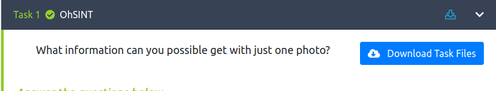
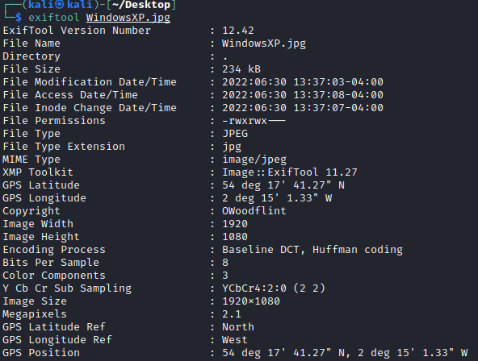
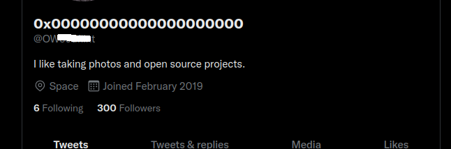

# Introduction

Hello and welcome to my write-up/walkthrough for the TryHackMe room [OhSINT](https://tryhackme.com/room/ohsint)

Upon joining the room, we are presented with a `Download Task Files` button. 

When we click on that we will download a very well known picture of the infamous Windows XP wallpaper. Now that we have that locally, we can begin!

(Note: Due to the information that's gathered, some questions won't have screenshots along with the steps taken, due to the ammount of information contained within, and would instantly give the answer away. Nonetheless, let's continue.)

## Question 1: What is this users avatar of?

Now that we have the picture locally, we need to examine some of the data attached to it to get the ball rolling. Specifically we need to look at the EXIF data that is embedded in the file, as it can contain quite a bit of information that hides in plain site. For this we can use a tool called `exiftool` that can be used on Kali Linux. 

### exiftool

In the terminal, we can navigate to where this picture is saved to, and run the command `exiftool WindowsXP.jpg`. We can see a lot of information in the results.

Out of all the information that we found, there are two fields that stand out. `Copyright` & `GPS Position`

Since they are asking for the contents of a profile picture, we need to find an account online that can be linked to information that is contained in the EXIF data. 

If we open up Google and do a search for `OWoodFlint` we are presented with a Twitter account that shares the name in question, and can see that the avatar is a */**

## Question 2: What city is this person in?

## Question 3: Whats the SSID of the WAP he connected to?

## Question 4: What is his personal email address?

## Question 5: What site did you find his email address on?

## Question 6: Where has he gone on holiday?

## Question 7: What is this persons password?

## Conclusion