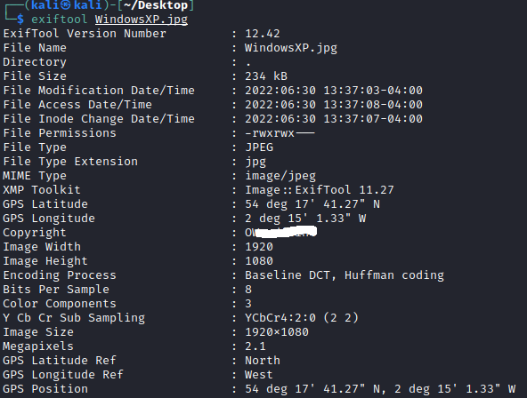

# Introduction

Hello and welcome to my write-up/walk-through for the TryHackMe room [OhSINT](https://tryhackme.com/room/ohsint)

Upon joining the room, we are presented with a `Download Task Files` button. 

When we click on that we will download a very well known picture of the infamous Windows XP wallpaper. Now that we have that locally, we can begin!

(Note: Due to the information that's gathered, some questions won't have screenshots along with the steps taken, due to the amount of information contained within, and would instantly give the answer away. Nonetheless, let's continue.)

## Question 1: What is this users avatar of?

Now that we have the picture locally, we need to examine some of the data attached to it to get the ball rolling. Specifically we need to look at the EXIF data that is embedded in the file, as it can contain quite a bit of information that hides in plain site. For this we can use a tool called `exiftool` that can be used on Kali Linux. 

### exiftool

In the terminal, we can navigate to where this picture is saved to, and run the command `exiftool WindowsXP.jpg`. We can see a lot of information in the results.

Out of all the information that we found, there are two fields that stand out. `Copyright` & `GPS Position`

Since they are asking for the contents of a profile picture, we need to find an account online that can be linked to information that is contained in the EXIF data. 

If we open up Google and do a search for `OWoodFlint` we are presented with a Twitter account that shares the name in question, and can see that the avatar is a */**

## Question 2: What city is this person in?

While we are on this twitter profile, there is a tweet that seems interesting.

While it doesn't seem like you can do much with that initially, the hint for the question mentions a site called `Wigle.net`. Let's take a look there. On the right hand side there is place to filter by `BSSID`, and there was one mentioned in that tweet. Once you enter that, and select `filter`, the location of the `BSSID` will be marked on the map. (Note: You will have to zoom out, and pan the map around to see where it is located.

## Question 3: Whats the SSID of the WAP he connected to?

For this, it appears that you need to make a (free) account. It doesn't send a verification email, so I don't believe that you will need to use a 'real' email if you don't want to. 

We can take the same `BSSID` that was in that tweet, and select `Advanced Search` from the `View` drop-down that is at the top-left of the website. We can enter that `BSSID` in the field on the right hand side of the page. 

At the bottom of that page, the SSID of the WAP that he is connected to. 

## Question 4: What is his personal email address?

Now we need to pivot, and see where else we can find information on this person. 

If we search the Twitter username in Google, we will can find a few other results that may be of interest. The next one that we should look at is the GitHub repo that appears in the results. With that, you will find the answer to question 4 and 5.

## Question 5: What site did you find his email address on?

See above. 

## Question 6: Where has he gone on holiday?

While this one doesn't seem to obvious at first, we first need to think about where "home" is for them. We tracked the SSID of his wifi to London, and his Github also mentions London. 

If we then take a look at the Wordpress page that appears in the search results for that username, there is a different location that they're in. That is the answer to question 6. 

## Question 7: What is this persons password?

Also on that same Wordpress site, there is a bit of 'hidden' information on the page. It appeared(for me) in the snippit of the result from Google, but can also be viewed by highlighting the page. Once you have found that, you have found the final answer for this room. 

## Conclusion

Thank you for taking the time to read my writeup for this room on TryHackMe. I hope that it was helpful if you got stuck along the way. 

You can read my other writeups for other THM rooms [here](https://github.com/alex-palmer616/THM-APalmer/readme.md)
