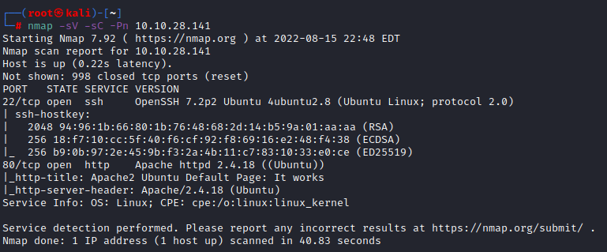
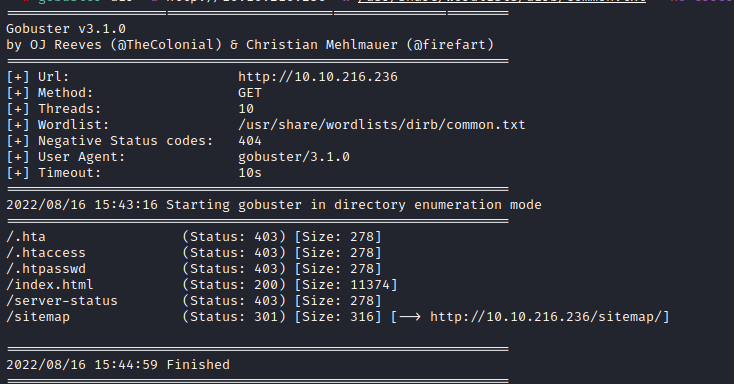

### Wgel CTF notes

[Wgel CTF](https://tryhackme.com/room/wgelctf)

Target IP: 10.10.28.141

nmap: `nmap -sV -sC -Pn 10.10.28.141`

p22 (ssh)

p80 (httpd 2.4.18)

gobuster:

`gobuster dir -u http://10.10.28.141 -w /usr/share/wordlists/dirb/common.txt`

Unresponsive, either wrong command syntax, or not really a webpage.

Default apache2 ubuntu page on `10.10.28.141`

With nowhere left to go at this point, rerunning nmap with `nmap -sV -sC -Pn -p- 10.10.28.141` to check for additional ports that are open above 1000, and will then rerun gobuster again. 
^^ I do believe that gobuster timed out due to connectivity issues, rather than gobuster not working. new nmap scan is taking ages, with server hanging on viewing page source. 

I have restarted the target machine to see if it was indeed network conectivity issues. The new IP address is 10.10.103.80. When I rerun gobuster I may edit the timeout length to see if that will make a difference, and if not, may need to resort to using TryHackMe's 'attack box'

