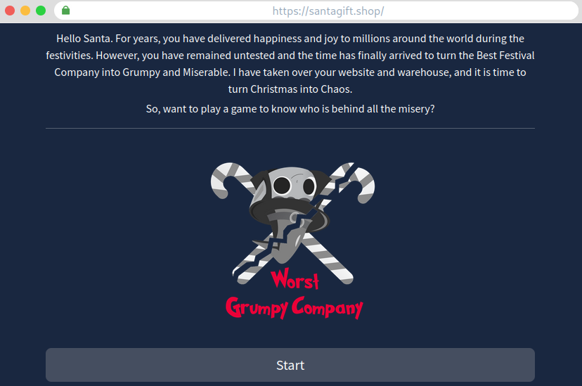
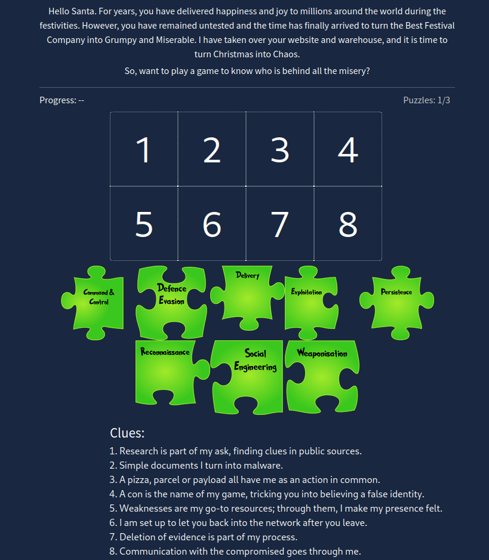
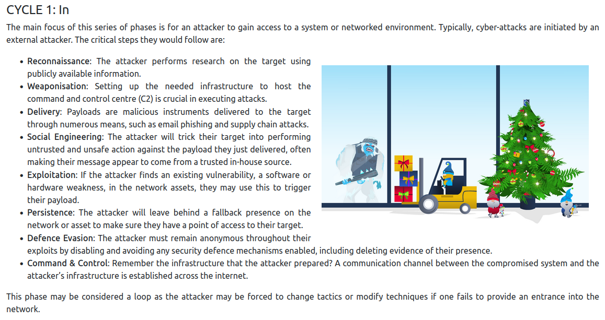
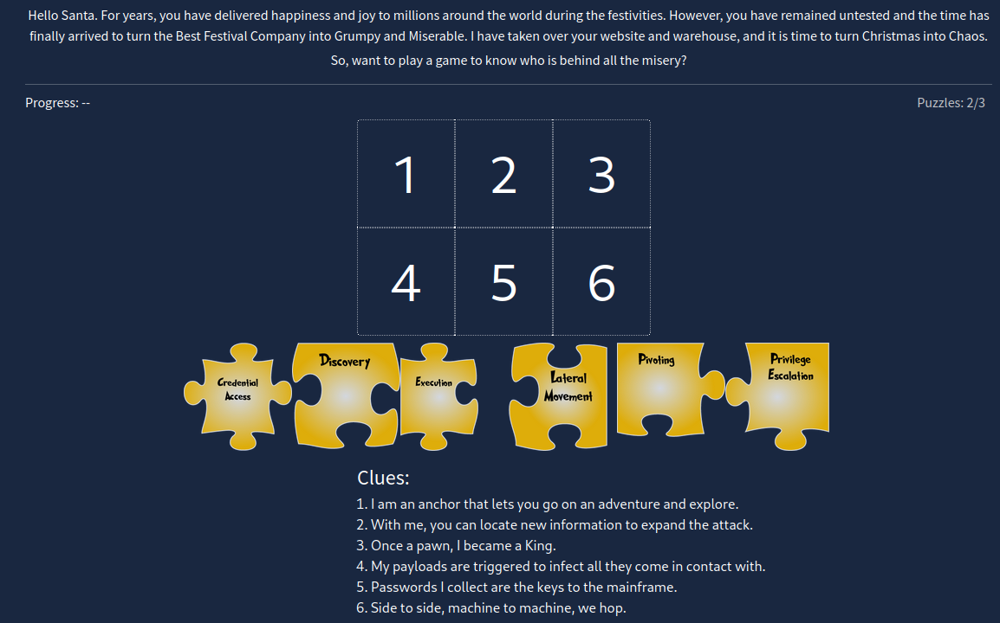
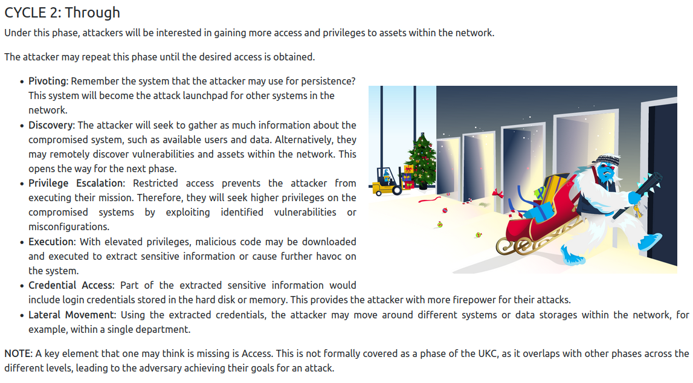
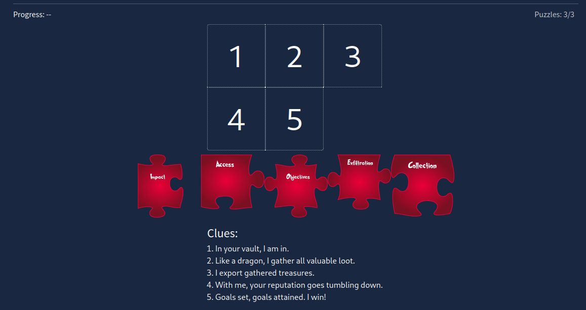
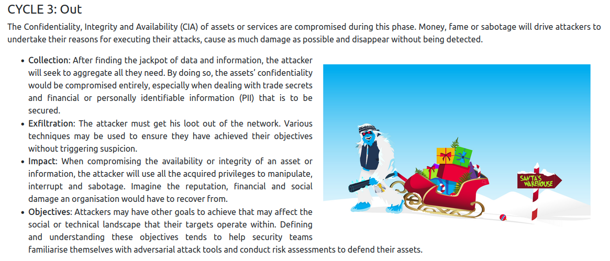
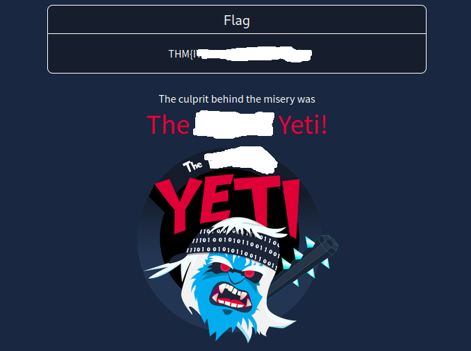

# Day 1: Someone's coming to town!

---

## Introduction. 

The challenge for the first day introduces and gives high level overviews of various security frameworks. 

While the challenge itself isn't overly "technical", it allows you to review what you learn in reading about each framework.

Story wise, we need to solve the puzzles that we left by our adversaries who are trying to stop Christmas this year. Each puzzle is a phase of the `Unified Kill Chain`, and solving the puzzles will reveal who is trying to stop Christmas. 

---

### Questions

This challenge has 2 questions that need to be answered to be 'Completed', and a third question that offers information about other rooms [TryHackMe.com](https://tryhackme.com) has to offer about attack frameworks. 

The 2 questions that we need to answer are:

- Who is the adversary that attacked Santa's network this year?

- What's the flag that they left behind?

To get both of these answers, we will need to solve the three puzzles that were left behind for us. 

---

### The first puzzle. 

To see the puzzles that we need to solve, we first need to select the `View Site` button that is just under the `Task 6` header. Once the site has loaded in split-view, we are greeted with the following message:

---

---

Clicking on `Start` will show us the first puzzle. 

---

---

The puzzle has 8 pieces with 8 clues to help us figure out where each piece will go.

The first puzzle covers the first phase of the `Unified Kill Chain`; `CYCLE 1: In`. 

This phase focuses on the threats, techniques and procedures (TTPs) attackes utilize to gain access to systems or networks.

 The clues are:

1. Reasearch is part of my ask, finding clues in public sources.

2. Simple documents that I turn into malware.

3. A pizza, parcel or payload all have me as an action in common

4. A con is the name of my game, tricking you into believing a false identity. 

5. Weaknesses are my go-to resources; through them, I make my presence felt. 

6. I am set up to let you back in to the network after you leave. 

7. Deletion of evidence is part of my process. 

8. Communication with the compromised goes through me. 

With each of the pieces being:

- Command and Control (C2)

- Defence Evasion

- Delivery

- Exploitation

- Persistance

- Reconaissance

- Social Engineering.

- Weaponisation

While I would like to include the answers, I think reviewing `CYCLE 1: In` of the Unified Kill Chain should get you to correct solution.

---

---

### The Second Puzzle. 

---

---

Much like the first puzzle, the second has 6 pieces with 6 clues. The clues are as follows:

1. I am an anchor that lets you go on an adventure and explore.

2. With me, you can locate new information to expand the attack. 

3. Once a pawn, I became a King. 

4. My payloads are triggered to infect all that they come in contact with.

5. Passwords I collect are the keys to the mainframe.

6. Side to side, machine to machine, we hop.

With each of the pieces being the following

- Credential Access

- Discovery

- Execution

- Lateral Movement

- Pivoting

- Privilege Escalation. 

---

For this one we can review `CYCLE 2: Through`

---

### The Third Puzzle

Continuing with the theme of the first two puzzles, the third utilized the third phase of the `Unified Kill Chain`, `CYCLE 3: Out`.

---

---

The five clues are:

1. In your vault, I am in. 

2. Like a dragon, I gather all valuable loot.

3. I export gathered treasures. 

4. With me, your reputation goes tumbling down. 

5. Goals set, goals attained. I win!

With the five pieces being the following. 

- Impact

- Access

- Objectives

- Exfiltration

- Collection

--- 

For this one we can review `CYCLE 3: Out`

---

### The final result. 

Once we have correctly solved each puzzle, we get the following page displayed.

---

On this page we can see both the name of our adversary that attacked Santa's network, and the flag that they left behind. 

### Conclusion

While this one wasn't overly technical, it did contain a lot of useful information that is important to be aware of. Hopefully you were able to find this little guide helpful, and be sure to check out my gudes for the other day's challenge [here.](https://github.com/alex-palmer616/THM-APalmer/tree/main/Rooms/advent-of-cyber-2022)

