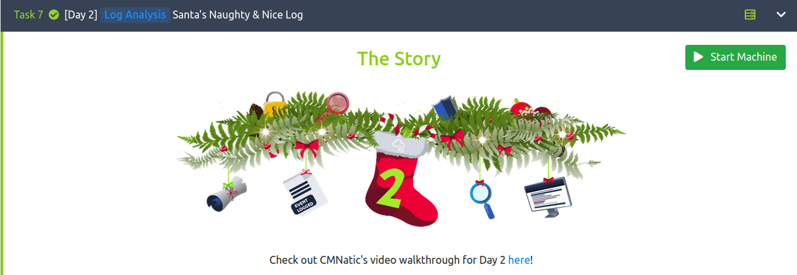
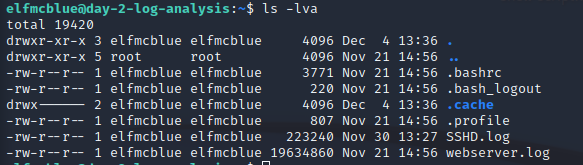
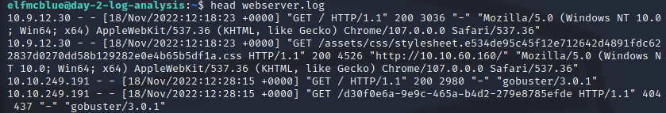
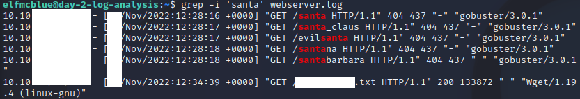
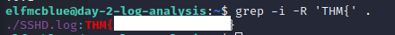

# Day 2: Santa's Naughty & Nice Log

---

## Introduction

---

Hello and welcome to my walkthrough for Day 2 of [TryHackMe](https://tryhackme.com)'s [Advent of Cyber 2022](https://tryhackme.com/room/adventofcyber4)

For this challenge, we need to start reviewing some logs to find out when Santa's list was stolen from their servers hosting `santagift.shop`

To complete this task, we can either SSH into the server, or use the provided AttackBox. I am going to utilize the SSH option, so your screens might look a little different. 

Note: In keeping these within the guidelines of TryHackMe, any specific answers and flags will be censored. 

---

## Questions. 

This challenge has quite a few more questions than the last, but all of them can be found fairly easily. 

We need to find the answers for the following questions:

1. Ensure you are connected to the deployable machine in this task. 

2. Use the `ls` command to list the files present in the current directory. How many log files are present?

3. Elf McSkidy manages to capture the logs generated by the web server. What is the name of this log file?

4. Begin investigating the log file from questions #3 to answer the following questions. 

5. On what day was Santa's naughty and nice list stolen?

6. What is the IP address of the attacker?

7. What is the name of the important list that the attacker stole from Santa?

8. Look through the log files for the flag. The format of the flag is: `THM{}`

---

###1. Connecting to the deployed machine

The first thing that we need to do in connect to the webserver that contains the logs. You can either use the provided AttackBox, or utilize `SSH` with the provided credentials. 

I am going to utilize `ssh` by running the following command.

`ssh elfmcblue@10.10.94.199` and entering `tryhackme!` for the password when prompted. 

---

### 2. Looking for some logs. 

Once we are connected to the server, question 2 tells us to run `ls` to view how many log files there are. 

These log files are located in `/home/elfmcblue` so you do not need to change directories. 

As you can see in the screen shot below, there are two log files. 

---

### 3. Finding the right log. 

Given that there are only two log files in the directory, we can utilize some preview commands to see what they contain.

I noticed that `webserver.log` was quite a large file, and opted to use `head` on that file rather than `cat`.

I also took a look at `SSHD.log` but that seems like it contains details of `ssh` connections. Because of this, the log that we need to search for the next few questions is `webserver.log`

---

### 5. 6. 7. Grepping for answers.

Now that we know which log that we need to look at, we can start using `grep` to find the information that we need. 

`grep` will save us a lot of time here, as `webserver.log` contains 189,714 lines! Finding the right entry manually would take forever, and is literally looking for a needle in a haystack. 

To find what we are looking for, we will use the following command:

`grep -i 'santa' webserver.log`

The syntax breaks down as follows:

- `grep`: The command to find lines of a file that contain the string you are looking for. 

- `-i`: case insensitive. Since we are looking for `santa`, `Santa`, `SANTA`, `santA`, etc. will be included in the results. 

- `'santa'`: The string that we are looking for. 

- `webserver.log`: The file that we want to look in.

---

---

There we have it! Once you find the line that contains the `GET` request for a `.txt` file, we can answer the questions!

---

##### 5. What day?

For this, take the date that is listed and review a calendar for that date. They are asking for which specific day of the week this event occurred on. 

#### 6. What is the IP address. 

This one is the IP address listed that begins with `10.10.`

#### 7. Name of the `.txt` file

Simply enter in the name of the `.txt` file that is listed in the line in question including `.txt` at the end. 

---

### 8. Finding a flag to wave. 

Now we need to find the flag in question. They give us the format of the flag we are looking for, `THM{}`.

Since we know that the flag will start with `THM{` lets use that to our advantage. Since there were initially 2 separate log files in this directory, lets save some time and use `grep` to search both in one command!

We can use the following command to search all of the files contained in the current directory:

`grep -i -G 'THM{' .`

The syntax breaks down as follows:

- `grep`: The command to find lines of a file that contain the string that we are looking for. 

- `-i` Case insensitive.

- `-R` Recursive. Looks for the string in all files starting at the specified directory. 

- `'THM{'` The string that we are searching for.

- `.` The directory to start the search from. `.` means the current directory we are in. 

---

After running that command we can see the following result:

---

### Conclusion. 

With that, we have completed the second day of [TryHackMe](https://tryhackme.com)'s Advent of Cyber 2022.

I hope you found this helpful, and be sure to check out my writeups for the other days [here](https://github.com/alex-palmer616/THM-APalmer/tree/main/Rooms/advent-of-cyber-2022)
