# Agent Sudo

Welcome to my write-up for the TryHackMe.com room [Agent Sudo](https://tryhackme.com/room/agentsudoctf)

## Task 1

Task 1 is a simple one. Join the room, deploy the machine and clink on submit. Task 1 completed. 

## Task 2: Enumerate.

Once the machine is deployed, we can begin. 

### Question 2.1: How many open ports?

#### nmap

For this we will run a `nmap` scan against the target `$ip` for this one I am using the command `nmap -sV -sC $ip` and we get the following results:

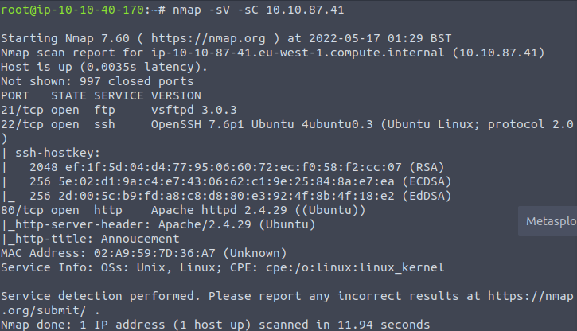

We can see that there are 3 ports open.
- 21(FTP)
- 22(SSH)
- 80(HTTP)

The answer for Question 1 is: *

### Question 2.2: How do you redirect yourself to a secret page?

To start looking for potential answers, first we will visit `$ip` in a web browser. Doing this shows the following:

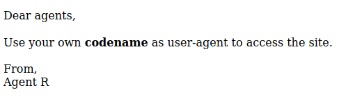

So we need to find *our* codename to use as the user-agent to gain site access. Viewing the page source reveals no extra information. So we need to move to the next option

#### gobuster

I want to attempt to find if there are any hidden directories or pages on the target. For this I am going to run a `gobuster` scan against the target `$ip`

Using the command `gobuster dir -u $ip -w /usr/share/wordlists/dirb/common.txt` to see if we find anything. 

This however didn't get us anything of importance, so we need to look a little further. 

#### User-agent

The text that we see when visiting `$ip` implies that we need to change our user-agent to our *codename*. The hint for the question mentions finding an add-on for Firefox and switching out user-agent to **C**. Doing so produces the following

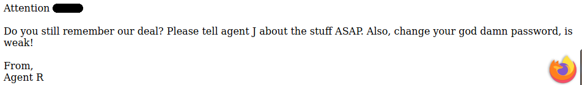

The answer to Question 2.2 is `****-*****`

### Question 2.3: What is the agent's name?

Upon switching our user-agent to **C** the page refers to us as `C****`

The answer to Question 2.3 is `C****`

## Task 3: Hash cracking and brute-force.

Now that we have competly enumerated the machine (as far as we can tell, we can move on to the next task.

### Question 3.1: FTP password. 

If we go back to the `nmap` scan, we can see that port 21 is open with the FTP service running. If we can assume that `Chris` is a username that could be used to access the FTP server. To find the password we can use the tool `hydra` to try and brute-force our way into the server.

#### hydra

Using the command `hydra -l chris -P /usr/share/wordlists/rockyou.txt ftp://10.10.87.41`

Doing so produces the following:

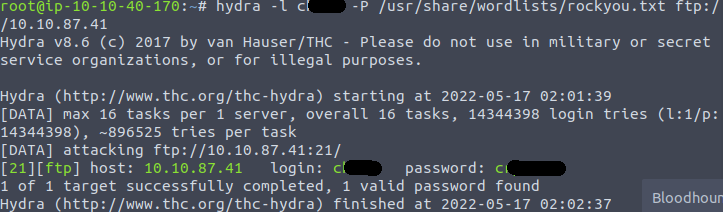

The FTP password and answer to question 3.1 is *******

### Question 3.2: Zip Password

Now that we have the password for the FTP server, we can log into the server and see what we have to work with. we can log in using `ftp $ip`. Upon entering the credentials that we have discovered, we can see that there are 2 images and a text file in the `/` directory.

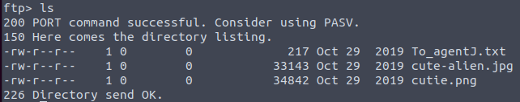

We need to download those to our machine using `get To_agentJ.txt``get cute-alien.jpg` and `get cutie.png`

Once we have those on our machine, we can start to by reading `To_agentJ.txt` to see the contents:

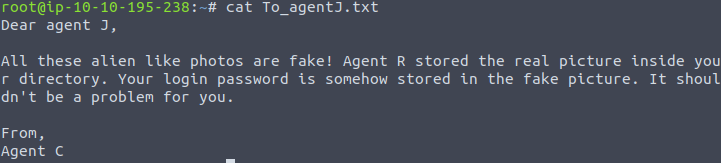

It looks like we have some files hidden in these pictures!

Since 3.2 is asking for a password to open a zip, I belive one of these images contains a hidden zip file.

#### binwalk

Since hidden files are implied, running `binwalk` against them would be the best option to start. 

Running the command `binwalk -e cutie.png` extracts the hidden files in a new directory (mine was `_cutie.png.extracted`

Opening that directory shows us a `.zip` file, and attempting to extract it prompts entering a password.

#### zip2john

The best way to crack a local password is with `john` but before we can utilize it, we need to generate a hash for `john` to crack. For this we can utilize `zip2john`

Running the command `zip2john 8702.zip > hash.txt` generates a hash that john can then use to find the password. 

#### john

We can now run the command `john --wordlist=/usr/share/wordlists/rockyou.txt hash.txt` and we get the following result:

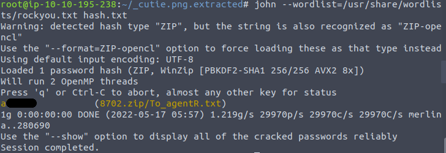

This is the answer to question 3.2, and with that we can now unzip the .zip, and move on!

### Question 3.3: steg password

After extracting the files we find a new file titled `To_agentR.txt` using `cat` to view it gives us this message:

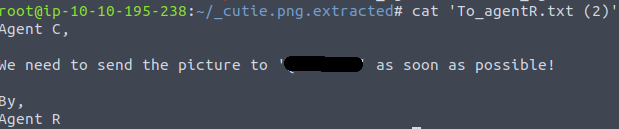

The block of text marked with '  ' looks like some form of encrypted or ciphered text. 

#### CyberChef

[CyberChef](https://gchq.github.io/CyberChef/) is a fantastic tool that can automatically find how text is encoded, and decypher it for you. Under the favorites menu, select `magic` and copy the text into the top box labeled `input`. Doing so reveals the following:

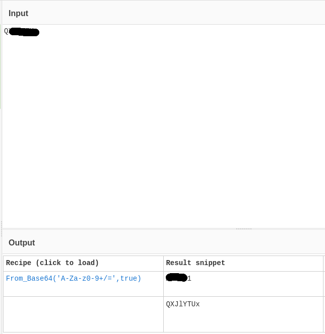

And here we have the answer to 3.3!

### Question 3.4 Who is the other agent(in full name) and 3.5: SSH Password.

#### steghide

To actually extract the data contained, we need to use `steghide` to find what is hidden in `cutie.jpg`. To do this we can run the command `steghide --extract -sf cute-alien` and enter the password we just descovered when prompted for a passphrase. Doing so extracts `message.txt`. Viewing the file shows us:

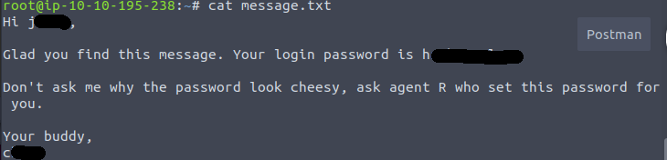

We now have the answer for both 3.4 & 3.5!

## Task 4: Capture the user flag. 

### Question 4.1: What is the user flag?

To find this, we need to SSH into the target machine using the information we found in `message.txt`.

We can do that by running `ssh *****@$ip` and entering the password we discovered when prompted.

Running an `ls` command once connected reveals the `user_flag.txt` is that directory along with a photo:

Viewing the `user_flag.txt` using `cat user_flag.txt` shows us:

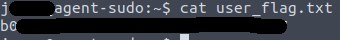

Copy and paste that into the answer form, and we have 4.1's answer!

### Question 4.2: What is the incident in the photo called?

This one feels a bit out of place, but it gives us some practice with the `scp` command.

#### scp

We first need to copy the picture to our machine. We can do that by entering this command in either a seperate terminal, or this terminal after you disconnect from ssh. `scp *****@$ip:/home/*****/Alien_autospy.jpg {destination}`

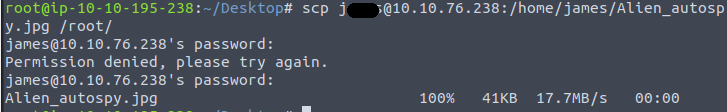

Once we have it on our machine, we can utilize either Google Reverse image search or [Tineye](Tineye.com) to find other instances of this image, and what the incedent was called. 

Doing this shows us the answer to question 4.2

## Task 5: Privilege Escalation

### Question 5.1: CVE number for the escalation.

Thankfully, there is a pretty big hint in the question asked. One of the first ways I always go when trying to escalate privilege is running `sudo -l` on the account I am logged in as. 

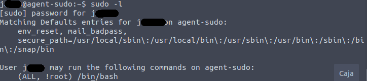

Doing so shows us an interesting line `(ALL, !root) /bin/bash`. Doing a quick search for that line plus CVE gives us a result on [exploit-db](exploit-db.com)

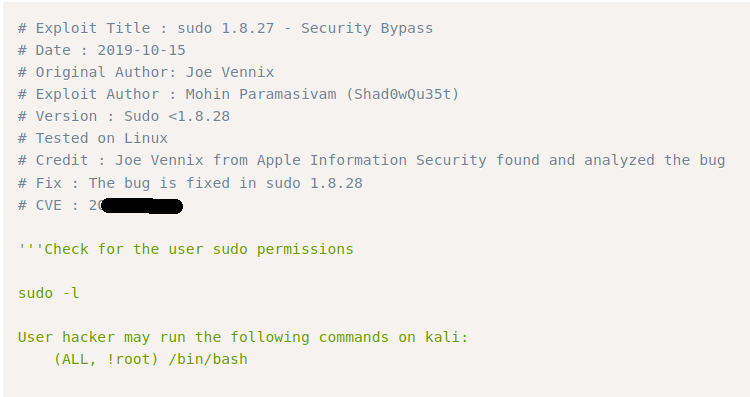

Enter the CVE number on that page to answer 5.1.

### Question 5.2: root flag

That same page shows us how to use this exploit.

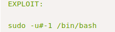

Entering that command `sudo -u#-1 /bin/bash` and then `whoami` shows that we are root!

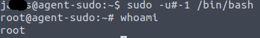

Navigating to the root directory with `cd /root/` and running `ls` shows us `root.txt` is present. 

Viewing the file with `cat root.txt` reveals the root flag, and the answer to the bonus question **Who is Agent R?**

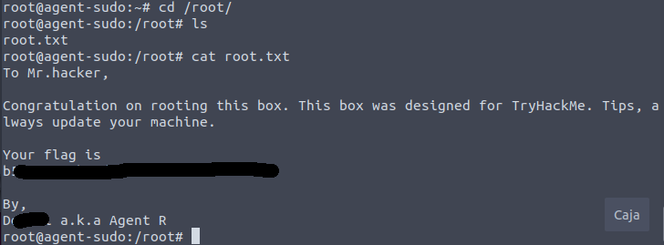

That completes the room Agent Sudo, thank you for taking the time to view this write-up, and I hope you found it helpful!

