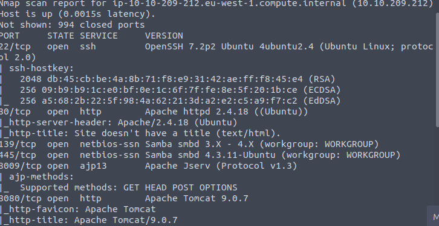
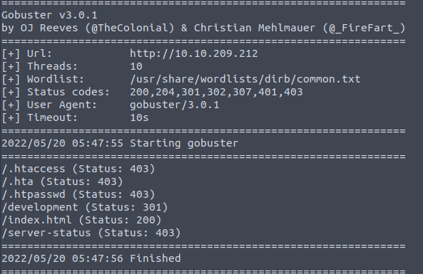
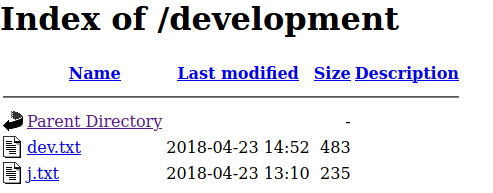
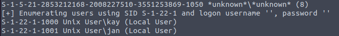
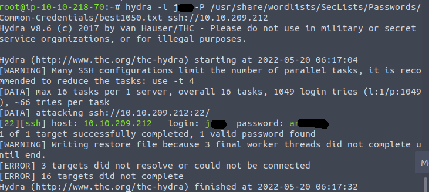
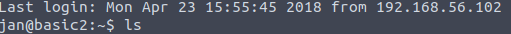
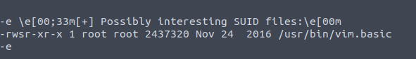

# Basic Pentesting

Welcome to my write-up/walkthrough for the TryHackMe room [Basic Pentesting](https://tryhackme.com/room/basicpentestingjt)

As with the rest of my write-ups and guides, any time we need to enter in the target machines IP address, it will be refered to as `$ip`, as this will be different for each person. With that out of the way, let's get started. 

## Find the services exposed by the machine

To start this off, we need to scan the target using `nmap`

### nmap

We can do this with a command consiting of `nmap -sV -sC $ip`
Once we have run that we see the following:

We can see that the following ports are open:
- 22(SSH)
- 80(HTTP)
- 139 (SMB)
- 445 (SMB)
- 8009
- 8080

Now that we have found the services, we can complete this portion and continue.

## What is the name of the hidden directory on the web server(enter name without /)?

For this, we are given a hint, but after `nmap` using `gobuster` is always the second step that I take. `gobuster` scans the target for hidden directories using a pre-defined word list. 

### gobuster

To run the gobuster scan, use the command `gobuster dir -u http://$ip -w /usr/share/wordlists/dirb/common.txt`

After it completes, we can see the following.

The answer to the question is d**********

## Use brute-forcing to find the username and password

Now that we have that directory, we can navigate to it in a browser using `$ip/d**********`. Once there we are greeted by a directory with two additional files:

Opening the first document `dev.txt` shows us the following:

The first thing that I notice, is the mention of the specific version `2.5.12` with the notes 'SMB has been configured' and 'I got Apache set up'. Odds are these are going to come into play later. 

The second document shows us the following:

So it looks like once we get into the machine, we have a hint on where one of the passwords will be

## What is the username?

At first I was a little confused on where to go with this one, as they usually like to throw an anonymous FTP server in the machine, or have other hidden things in the site's source code. But the hint reminds us about the SMB shares, and using that to enumerate a username.

### enum4linux

`enum4linux` is a great tool to scan targets for information beyond what `nmap` will provide. The scans provide **A LOT** of information, but it should show us what we need. 

Running `enum4linux -U $ip` gives us the following roughly in the middle of the scan:

We get two results, J** and K\**.  Based on the document `j.txt`, we can gather the username we are looking for is J**

## What is the password?

Now that we have the username that we are looking for, we need to utilize a tool to find the password. In the `nmap` scan, we found that port 22 was open for SSH connections. And one of the best tools to brute-force SSH is `hydra`

### hydra

Now that we have the username J** and know that we need to use hydra to crack the SSH password, we can put together the following command `hydra -l j** -P /usr/share/wordlists/SecLists/Passwords/Common-Credentials/best1050.txt`

**NOTE** SSH cracking is not a very fast process, and your selection of wordlist can make a huge difference. I normally use password lists that are included with `SecLists`, and start with best50.txt and work my way up in number.

Once that has completed, we see that `hydra` was able to find the password!

We can see that the password is a******. Using the user name that we found earlier we can SSH into the target machine. 

## What service do you use to access the server(answer in abbreviation in all caps)?

Well, I kind of got ahead of myself and gave that answer away, but what other options were there? Enter in SSH, and SSH into the machince using `ssh j**@$ip` and enter the password when prompted. 

## Enumerate the machine to find any vectors for privilege escalation.

After we have connected via SSH, we need to find out how to get further into the machine. To start we can use a tool called `linenum` it can be found here: [LinEnum](https://github.com/rebootuser/LinEnum) When using this on a target, you will either need to copy/paste `LinEnum.sh` into a new `.sh` file, or you will need to use `curl` to download it onto the machine. Using `curl` here didn't seem to want to work, so I went with the copy/paste.

### linenum

Run the script using `sh linenum.sh` and scroll through the results, looking for `SUID files` and `Possibly interesting SUID files` In this case, under `Possibly interesting SUID files` There is one that stands out. 

We can now look for ways to escalate our privilege with `vim.basic`

### GTFObins

[GTFObins](https://gtfobins.github.io/) is the one stop shop for escalating privilege. 

## What is the name of the other user you found(all lower case)?

## If you have found another user what can you do with this information?

## What is the final password you obtain?
