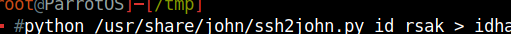
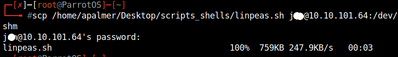
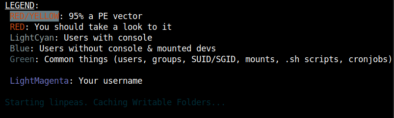
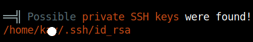
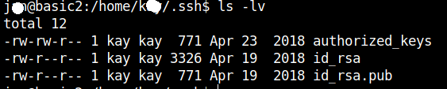
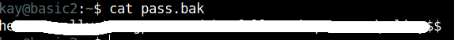

# Basic Pentesting

Welcome to my write-up/walkthrough for the TryHackMe room [Basic Pentesting](https://tryhackme.com/room/basicpentestingjt)

As with the rest of my write-ups and guides, any time we need to enter in the target machines IP address, it will be refered to as `$ip`, as this will be different for each person. With that out of the way, let's get started. 

## Find the services exposed by the machine

To start this off, we need to scan the target using `nmap`

### nmap

We can do this with a command consiting of `nmap -sV -sC $ip`
Once we have run that we see the following:

We can see that the following ports are open:
- 22(SSH)
- 80(HTTP)
- 139 (SMB)
- 445 (SMB)
- 8009
- 8080

Now that we have found the services, we can complete this portion and continue.

## What is the name of the hidden directory on the web server(enter name without /)?

For this, we are given a hint, but after `nmap` using `gobuster` is always the second step that I take. `gobuster` scans the target for hidden directories using a pre-defined word list. 

### gobuster

To run the gobuster scan, use the command `gobuster dir -u http://$ip -w /usr/share/wordlists/dirb/common.txt`

After it completes, we can see the following.

The answer to the question is d**********

## Use brute-forcing to find the username and password

Now that we have that directory, we can navigate to it in a browser using `$ip/d**********`. Once there we are greeted by a directory with two additional files:

Opening the first document `dev.txt` shows us the following:

The first thing that I notice, is the mention of the specific version `2.5.12` with the notes 'SMB has been configured' and 'I got Apache set up'. Odds are these are going to come into play later. 

The second document shows us the following:

So it looks like once we get into the machine, we have a hint on where one of the passwords will be

## What is the username?

At first I was a little confused on where to go with this one, as they usually like to throw an anonymous FTP server in the machine, or have other hidden things in the site's source code. But the hint reminds us about the SMB shares, and using that to enumerate a username.

### enum4linux

`enum4linux` is a great tool to scan targets for information beyond what `nmap` will provide. The scans provide **A LOT** of information, but it should show us what we need. 

Running `enum4linux -U $ip` gives us the following roughly in the middle of the scan:

We get two results, J** and K\**.  Based on the document `j.txt`, we can gather the username we are looking for is J**

## What is the password?

Now that we have the username that we are looking for, we need to utilize a tool to find the password. In the `nmap` scan, we found that port 22 was open for SSH connections. And one of the best tools to brute-force SSH is `hydra`

### hydra

Now that we have the username J** and know that we need to use hydra to crack the SSH password, we can put together the following command `hydra -l j** -P /usr/share/wordlists/SecLists/Passwords/Common-Credentials/best1050.txt`

**NOTE** SSH cracking is not a very fast process, and your selection of wordlist can make a huge difference. I normally use password lists that are included with `SecLists`, and start with best50.txt and work my way up in number.

Once that has completed, we see that `hydra` was able to find the password!

We can see that the password is a******. Using the user name that we found earlier we can SSH into the target machine. 

## What service do you use to access the server(answer in abbreviation in all caps)?

Well, I kind of got ahead of myself and gave that answer away, but what other options were there? Enter in SSH, and SSH into the machince using `ssh j**@$ip` and enter the password when prompted. 

## Enumerate the machine to find any vectors for privilege escalation.

### scp

After we have connected via SSH, we need to find out how to get further into the machine. To start we can use a tool called `linPEAS` it can be found here: [LinPEAS](https://github.com/carlospolop/PEASS-ng/tree/master/linPEAS) When using this on a target, you will either need to copy/paste `linpeas.sh` into a new `.sh` file, or use `scp` to transfer `linpeas.sh` from our machine, to the target. Using `scp` is the better option in this case, and can be accomplished using `scp $filepath/linpeas.sh j**@$ip/dev/shm`

### linPEAS

After the transfer is complete, `cd` into that directory, and run `linpeas.sh` with `sh linpeas.sh`. Allow it to run, and when it completes, begin to examine the output. The beautiful thing about `linpeas.sh` is that it attempts to color-code the output, allowing for quick visual scanning, to see what we can abuse to escelate our priviledge. 

One thing stood out to me when examining the file. It found SSH keys in `/home/k**/.ssh`!

Navigating to that directory, we can see that see that there is two interesting files, `id_rsa` and `id_rsa.pub` and that we can read both of them!

Using `cat id_rsa`, we can copy the entire key, and paste it into a new file on our machine named `id_rsak` to connect to the target machine under the user 'k**'. However, before we do that, we need to use `chmod` to change the permissions of `id_rsak`, since the current permitions (644) are 'too open' for the ssh connection to work. We can do that using `chmod 600 id_rsak`

Once we do that, we can ssh into the machine using this key with `ssh -i id_rsak k**@$ip`. But when we do this, we get the following message:

We now need to figure out the passphrase for the ssh key that we recovered. John the Ripper would be our best option, but we need to generate a hash for John to crack. We can do that with `ssh2john`

### ssh2john

we need to use `ssh2john` to generate a hash that John the Ripper can then crack to give us the passphrase that we need. To do this, we first need to find where `ssh2john.py` is located on our machine. Mine was located at `/usr/share/john/ssh2john.py`. This may vary depending on your distro, but this was the default for ParrotOS.

Now that we have found that, we can run it with in the same directory our `id_rsak` is located in with `python /usr/share/john/ssh2john.py id_rsak > idhash`

 

### john

Now that we have the hash, we can utilize `john` to get our passphrase using `john idhash --wordlist=/usr/share/wordlists/rockyou.txt > passphrase`. I chose to output the results to `passphrase` incase I needed to acces it again at a later time. Once that has run we can see that we have the passphrase `b******`!

We can finally ssh into the target as k**

## What is the name of the other user you found(all lower case)?

While I answered this doing the previous section, the answer is `k**`

## If you have found another user what can you do with this information?

Again, I discovered this during the enumeration section, but we can log in via ssh. The hint also alludes the fact that we can login with out a password using ssh.

## What is the final password you obtain?

After connecting to the target machine, using k**'s ssh key, and the passphrase we cracked, we now need to find the last password to complete the room. We can see in their home directory that there is a `pass.bak`. Running `cat pass.bak` give us the following:

We can copy that into the final answer box, to complete the room.

## Conclusion

Thank you for taking the time to read this, and I hope that it helped you in completing this room!
