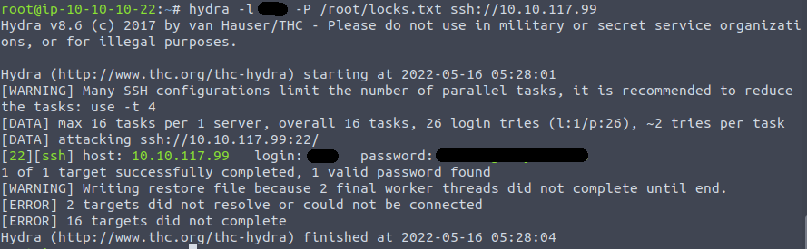

# Bounty Hacker.

This is an overall guide and write up for the 'Bounty Hacker' room on TryHackMe.com

Any time the target machine's ip is required the commands will have `$ip`. `$ip` = IP address of the target.

## Enumeration.

To begin we need to deploy the machine. Click on the `Start Machine` button next to Question 1.

After the machine has started, we need to scan for open ports on the target machine. For that we can use `nmap`

### nmap

The scan that I ran to find the open ports was `nmap -sV -sC $ip`. From that we gather the following results:

The open ports are:
- 21 (FTP)
- 22 (SSH)
- 80 (HTTP)

One thing that stood out in the results of the nmap basic script scan (`-sC`) was under port 21 there was a line that said "ftp-anon: Anonymous FTP login allowed (FTP code 230)

It looks like we can login to the server anonymously using FTP. We will keep that in mind.

There is no answer needed for question 2, so we can continue.

## Enumeration Continued.

The next question, is who wrote the task list. We know from `nmap` that anonymous FTP is allowed, but before we give that a chance, I wanted to make sure that there wasn't anything else out in the 'open' that would be useful. Opening `$ip` in a browser gives us a web page with an image, and some flavor text for a bit of story. 

At first I ran a `gobuster` command using `gobuster dir -u $ip -w /usr/share/wordlists/dirb/common.txt` and got the following results:

Given the directories found, nothing useful was found with that.

The next thing to do is to attempt to log in via FTP

### FTP

Attempting to connect via FTP using `ftp $ip` gives us a prompt asking for a username. Entering `anonymous` and pressing enter gives us the following:

I ran a `pwd` to see where I was in the file system followed by `ls` to see what was in there. And it looks like we got something!

In a FTP connection, `cat` doesn't work. So to get those files we can use `get locks.txt` and `get task.txt`. This will download them to our machine in our `/root/` directory.

Upon opening `task.txt` we can see that the task list was written by ***. *This is the answer to Question 3: Who wrote the task list?*

Upon opening `locks.txt` we get what looks to be a list of possible passwords.

## Getting access to the machine

Question 4 asks "What service can you bruteforce with the text file found?" If we go back to the list of ports(services) we found with `nmap` we already have utilized two out of the three found. `port 21(ftp)` and `port 80(http)` which only leaves `port 22(***)` left. *** in the answer to Question 4.

### hydra

One of the best tools to use to bruteforce online logins is `hydra` for `hydra` to run, we need to provide either a username or a list of usernames (-l and -L respectivly), either a password or a list of potential passwords (-p and -P respectivly), the service we are bruteforcing, and the url or ip address of the target.

For the username in this case, I originally made a .txt file with all of the names that were noted upon visiting `$ip` in my browser. However that did not produce any results. I then remembered about the `task.txt` that we downloaded from the ftp server, and used that name instead. For the potential passwords, `locks.txt` looks like it would make a good list. 

Running the command `hydra -l *** -P /root/locks.txt ssh://$ip` gave me the following result that is also the answer to Question 4, What Is the users Password?

Now that we have a user and password we can get into the machine!

## SSH

With the user and password that we found with hydra we can ssh into the target using `ssh ***@$ip`
Type `Y` to accept the certificate, and enter the password that was found. 
Upon connection, running a `ls` command shows us that there is a file named `user.txt` in the `~/Desktop` directory.

Upon using `cat user.txt` we get the answer to *Question 5: user.txt*

### Escelation to view root.txt

The last thing that we need to complete this machine, is to find the contents of `root.txt`

The first thing that I did was to see if there were any commands that this user can use `sudo` on. For this I used `sudo -l` and we get the following result:

We can use `tar` utilizing `sudo` privilage. We now need to see if there is a way to exploit that to our advantage. 
The site 'GTFObins' is an extensive database of different ways you can escalate your privilage, and is the first place that I will look. Upon visiting  it looks like we can use a command with `sudo` and `tar` that will make our `sudo` privilage carry over to other commands. 

Using the command `sudo tar -cf /dev/null /dev/null --checkpoint=1 --checkpoint-action=exec=/bin/sh` and then proceeding to use `ls -lva /root/` shows us that there is a file named `root.txt` we can the use `cat /root/root.txt` and get the final answer we need!
