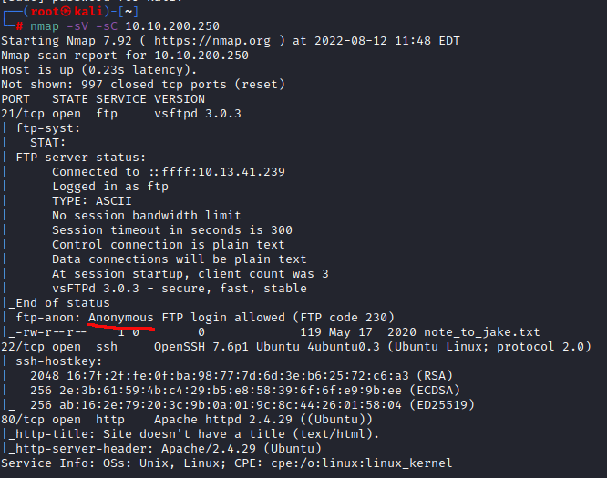
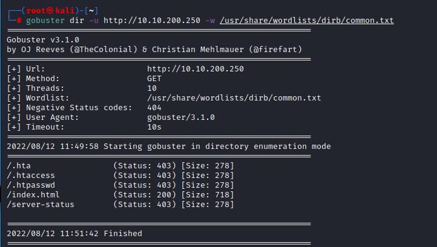
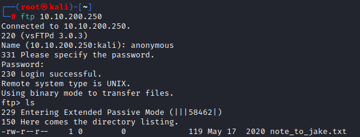
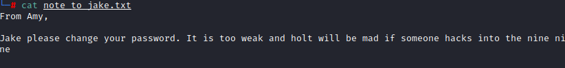
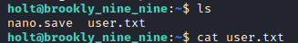

### brooklyn nine nine Notes

#### info

Target IP address: 10.10.200.250

Nmap
`nmap -sV -sC $IP`

ports
21 (anon FTP)
22 (ssh)
80 (http)

Gobuster

`gobuster dir -u http://10.10.200.250 -w /usr/share/wordlists/dirb/common.txt`

/index.html
/server-status

## FTP

`ftp $IP`

`get note_to_jake.txt`

## Steg

`stegcracker brooklyn99.jpg`

##SSH

holt:fluffydog12@ninenine

