# Intro

Hello and welcome to my walk-through/writeup for the [TryHackMe](http://tryhackme.com) room [Brooklyn Nine Nine](https://tryhackme.com/room/brooklynninenine).

This was a pretty fun one that while still keeping it on the easy side, introduced a few concepts that often aren't utilizied in 'easy' rooms.

Just to make a quick note, any time that `$IP` is used within a command, `$IP` is the IP address of the target machine. With that out of the way let's begin!

## Objectives. 

This room only has two things to find. 

- `user.txt`
- `root.txt`

Because there are only these two flags to find, we can already get an idea of what we will need to do in order to obtain them. 

We will first need to gain access to the target machine to find `user.txt`, and then escalate our privilege to find `root.txt`. Now to find out how we can gain access. 

## Enumeration

As always, we need to try and get as much information as we can to see which vectors we can utilize to reach our objectives. I personally always start with a fairly basic `nmap` scan, and then follow that up with a `gobuster` scan. From there I will then visit the target in a web browser to take a look at what those two scans find. 

### nmap

We will want to run a `nmap` scan against the target using the command `nmap -sV -sC $IP`. Doing so will reveal the following:

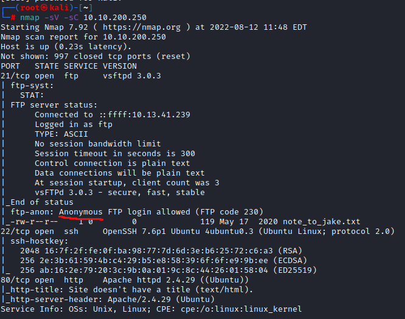

We can see that there are a few different ports open. 

- 21 (FTP) (Note the anonymous access that is highlighted above)
- 22 (SSH)
- 80 (HTTP)

So we might be able to utilize `ssh` to access the machine, we can see if there is anything interesting in the `ftp` server, and it appears that there is a website that is being hosted on the target that we can check out. But first, we should continue on with a `gobuster` scan. 

### gobuster

I always like to run a `gobuster` scan against the target using the command `gobuster dir -u $IP -w /usr/share/wordlists/dirb/common.txt`. Once that has completed, we see the following:

There wasn't too much that we found with it this time, but sometimes it has usefull results. 

The next place that we will want to check, is the website that is being hosted on the target. 

Throwing `$IP` into Firefox shows us an image that automatically takes up our entire screen, with some text explaining that it will always fit to your browser. 

This doesn't seem all that useful, so the last thing that we can look at here is the page source. 

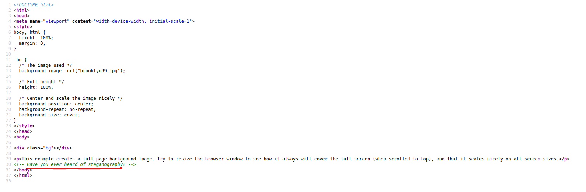

There seems to be a 'hidden' note left 

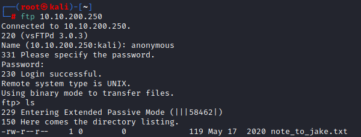

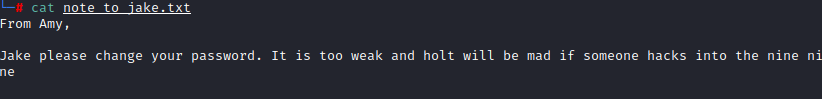

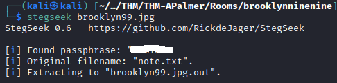

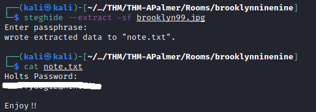

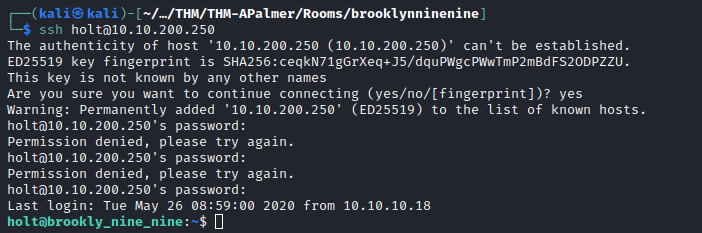

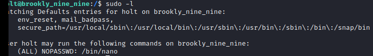

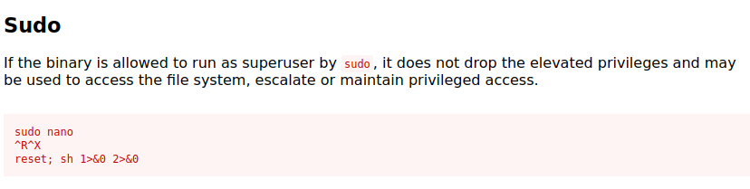

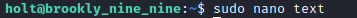

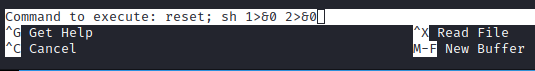

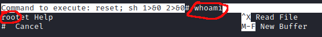

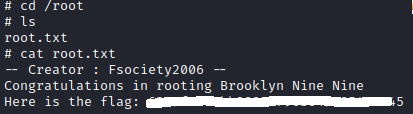

