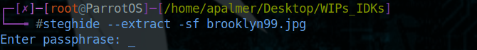

# Intro

Hello and welcome to my walk-through/writeup for the [TryHackMe](http://tryhackme.com) room [Brooklyn Nine Nine](https://tryhackme.com/room/brooklynninenine).

This was a pretty fun one that while still keeping it on the easy side, introduced a few concepts that often aren't utilizied in 'easy' rooms.

Just to make a quick note, any time that `$IP` is used within a command, `$IP` is the IP address of the target machine. With that out of the way let's begin!

## Objectives. 

This room only has two things to find. 

- `user.txt`
- `root.txt`

Because there are only these two flags to find, we can already get an idea of what we will need to do in order to obtain them. 

We will first need to gain access to the target machine to find `user.txt`, and then escalate our privilege to find `root.txt`. Now to find out how we can gain access. 

## Enumeration

As always, we need to try and get as much information as we can to see which vectors we can utilize to reach our objectives. I personally always start with a fairly basic `nmap` scan, and then follow that up with a `gobuster` scan. From there I will then visit the target in a web browser to take a look at what those two scans find. 

### nmap

We will want to run a `nmap` scan against the target using the command `nmap -sV -sC $IP`. Doing so will reveal the following:

We can see that there are a few different ports open. 

- 21 (FTP) (Note the anonymous access that is highlighted above)
- 22 (SSH)
- 80 (HTTP)

So we might be able to utilize `ssh` to access the machine, we can see if there is anything interesting in the `ftp` server, and it appears that there is a website that is being hosted on the target that we can check out. But first, we should continue on with a `gobuster` scan. 

### gobuster

I always like to run a `gobuster` scan against the target using the command `gobuster dir -u $IP -w /usr/share/wordlists/dirb/common.txt`. Once that has completed, we see the following:

There wasn't too much that we found with it this time, but sometimes it has usefull results. 

The next place that we will want to check, is the website that is being hosted on the target. 

Throwing `$IP` into Firefox shows us an image that automatically takes up our entire screen, with some text explaining that it will always fit to your browser. 

This doesn't seem all that useful, so the last thing that we can look at here is the page source. 

There seems to be a 'hidden' note left. Since they call out steganography by name, I think that it is a safe assumption we will need to utilize it to get some information that we will need to proceed. 

I saved the image locally, and attempted to run `steghide` on the image, but it prompted for a password. 

This prompted me to see if there was anything of note in the FTP server that we found in the `nmap` scan that allows anonymous access.

#### FTP

I connected to the FTP server with `ftp $IP`, entered `anonymous` for a username and left the password field blank. 

Once connected, I ran `ls` to see what was on there, and we found a note. 

Running `get note_to_jake.txt` copies the file to our machine. Once that is complete, we can `exit` and then `cat note_to_jake.txt` to see what it contains. 

Well that doesn't seem to be of much use...

It looks like we will need to find a tool that can bruteforce the password needed to view what is hidden in `brooklyn99.jpg`

#### Stegseek

I ended up finding a tool called [Stegseek](https://github.com/RickdeJager/stegseek). It has to be one of the fasted tools that can be utilized to bruteforce the password of a stegfile. It is quoted as being able to go through `rockyou.txt` in seconds.

Once we have that installed we can use the command `stegseek brooklyn99.jpg` which will give us the password, and extract to contents for us as seen below:

Once the contents are extracted, we can see that this new note contains a password for `holt`

Now that we have the password, we can `ssh` into the target machine.

#### ssh

Once we have connected via `ssh` running an `ls` shows us that `user.txt` is located in the current directory. 

Since we have `user.txt` now, we just need to figure out how we can gain elevated privileges to get `root.txt`. A good way to see if there is something that we can exploit is to run `sudo -l`. This will show us what, if anything, we can run with `sudo` privileges. 

As you can see, we are allowed to use `sudo` with `nano`. Next, let's look at [GTFObins](https://gtfobins.github.io) and see if there is a way we can use this to our advantage. 

As you can see below, there is an entry for `nano` with a way that we can exploit this. 

To utilize this, we need to first run `sudo nano test`. After we enter our password, we are presented with a new file inside of `nano`. Inside the editor we then press `ctrl+R` followed by `ctrl+X` and then enter `reset; sh 1>&0 2>&0` and then press enter.

After you press enter, you can then enter other commands. Running `whoami` shows that we are currently `root`

Now that we are `root` we can run `cd /root` and `ls` to see that `root.txt` is located in `/root`.

Running `cat root.txt` will give us the final flag that we need to complete the room!

### Conclusion

Thank you for taking the time to read through this guide that I have written. 

I hope that you found it helpful, and be sure to check out my other guides [here](https://github.com/Alex-palmer616/THM-Apalmer)
