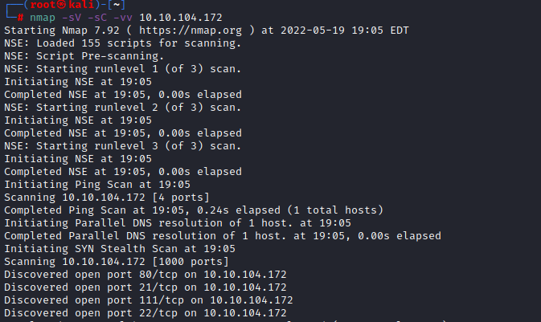
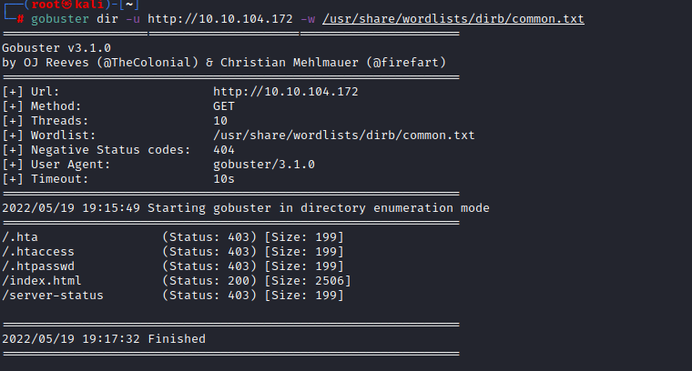

# Lian_Yu

This is my guide/write-up for the TryHackMe room [Lian-Yu](

To start I began running an nmap scan against the target `$ip` using `nmap -sV -sC -vv $ip`

We can see that there are 4 open ports:

- 21(FTP)
- 22(SSH)
- 80(HTTP)
- 111 (?)

We now should continue enumeration using a gobuster scan against the target `$ip` using the command `gobuster dir -u http://10.10.104.172 -w /usr/share/wordlists/dirb/common.txt`

Doing so will produce the following:

