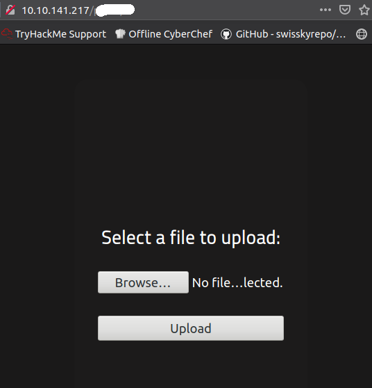
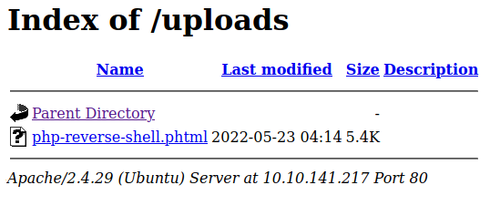

# RootMe

Hello, and welcome to my write-up/walkthrough for the TryHackMe room [RootMe](https://tryhackme.com/room/rrootme)

As with any of my other guides, anytime the IP address of the target machine is needed, `$ip` will be used instead, as this will vary for everyone.

# Task 1: Deploy the machine. 

Well. This is pretty straight forword. Click the `Start Machine` button, to well. Start the machine. Click on `Question Done`. And just like that we are one step closer to the finish line. 

# Task 2: Reconnaissance

It looks like we will start by gathering as much information as possible, before we decide on an attack vector.

## 2.1: Scan the machine, how many ports are open?

The first step that we are going to take is scanning the target machine with `nmap`

### nmap

We can do this using the command `nmap -sV -sC -Pn -vv $ip`

Doing so gives us the following:

And we can see the answer is 2.

## 2.2: What Version of Apache is running?

Looking at the scan results, we can see that version 2.4.** of Apache is running on port 80

The answer is 2.4.**

## 2.3: What service is running on port 22?

Looking at the scan results again, we can see that SSH is running on port 22.

The answer is SSH. 

## 2.4 Find Directories on the web server using the GoBuster tool.

The next step that we need to take is to run `gobuster` against the target.

### gobuster

We can do that by running the command `gobuster dir -u http://$ip -w /usr/share/wordlists/dirb/common.txt`. Running that shows us the following:

## 2.5 What is the hidden directory?

When we look at the results of the `gobuster` scan, we can see that `/pa***/` is the hidden directory.

The answer is `/pa***/`

# Task 3: Getting a shell

The next thing that we need to do is to visit that directory ina browser. Open one up, and enter `$ip/pa***/` Upon doing so, we can see the following:

We can upload something. But we need to figure out what, and where we can go to access it when we do.

If we go back to our `gobuster` scan, we can see that there is a directory that was found called `/uploads`. Visiting this shows us a empty directory. 

I bet once we find out what to upload, it will show up here!

## 3.1 Find a form to upload and get a reverse shell, and find the flag. 

### PHP reverse shell (via pentestmonkey.net)

Since we know that we need to upload a reverse shell, we can go and find one that we can utilize for this purpose. [pentestmonkey](https://pentestmonkey.net) has a very useful PHP reverse shell that we might be able to utilize [here](https://pentestmonkey.net/tools/web-shells/php-reverse-shell)

If you are using the AttackBox provided by THM, you can use `wget http://pentestmonkey.net/tools/php-reverse-shell/php-reverse-shell-1.0.tar.gz` to clone it on your machine. Extract the contents, and we will need to change a few values before we can utilize this. 

Navigate to the folder that it is contained in, and use `nano php-reverse-shell.php` to open it in nano.

This shell is extremely well documented, and upon opening it in nano we can see the following:

Change the `$ip =` line to reflect your own IP address. 

Change the `$port =` to a port that you will remember (using 1234 for the port works just as well, if you are afraid of forgetting which port you selected)

After doing this, you will exit (saving changes), and we can attempt to upload this to the web server. 

Go back to `$ip/pa***` in your web browser, select `browse` and navigate to the `php-reverse-shell.php` that we just added our details to. Once the file is selected, lets click `upload`.

Damn. It looks like .php files are not permitted. 

We now need to see if there are alternate forms of .php files that might be able to slip past this filter. 

With a quick search on Google, I came across this little chart: 

I would directly link it, however it appears to be a site attempting to profit off of this info, and other pages. 

It looks like we might be able to slip it past the filter if we change the file extention to something other than `.php`.

Using the command `mv php-reverse-shell.php php-reverse-shell.phtml` will change the file extention to `.phtml`, and we can try to upload the 'new' file instead!

With the `.phtml` file selected, we can go ahead and click on `upload`

And Success!

We can now confirm that the file is uploaded, by visiting `$ip/uploads` in our browser.

We can see that it is indeed on the server. But now how do we utilize it?

### netcat

Once the file is uploaded, we need to set up a listener to listen for our shell to call home. For that we can use a tool called `netcat`. To use this, open a new terminal, and run the command `nc -lvnp 1234` where the numbers are the port that you had entered when we edited the file with `nano`

Once we run that, the terminal should show the following

Once its running, we can navigae back to `$ip/uploads` and click on the file `php-reverse-shell.phtml` and when we go back to the terminal that we launched `netcat` in, we will see the following:

And we are in! Now, we just need to find out where the `user.txt` flag is located. Running `find . -name "user.txt"` Spits a lot of info at us, but we can see that `user.txt` exists in the `/var/www/` directory

Run `cat` against the file using `cat /var/www/user.txt` and you will get the flag!

# Task 4: Privilege Escalation.

## 4.1: Search for files with SUID permission, which file is weird?

Utilizing the `find` command, we can run a search to see which files have `SUID` permission. From experience, the files used to escalate to `root` are almost always found in `/usr/bin`, so I ran the command `find /usr/bin -perm /4000` to find any files with the `SUID` permission in the `/usr/bin` directory. 

And one of these stand out to me. `/usr/bin/python`. Python is fequently used as an attack vector to escalate to root. 

## 4.2: Find a form to escalate your privileges.

Now we need to see how we can abuse python having a `SUID` to gain root access. The website [GTFObins](https://gtfobins.github.io/) Is an amazing resource for finding out how to abuse files with a `SUID` permission

### GTFObins

After visiting [GTFObins](https://gtfobins.github.io/) we can navigate down to the `Python` section, and view the following:

Using the command `python -c 'import os; os.execl("/bin/sh", "sh", "-p")'` should give us root privilege. We can verify by running `whoami`

And we are root!

## 4.3: root.txt.

Navigate to the `/root` directory, and run an `ls` command. We can see that `root.txt` is present. 

View it with `cat root.txt` and we have the final flag!

# Conclusion.

Thank you very much for taking the time to view this write-up/walkthrough, and I hope you found it helpful!

