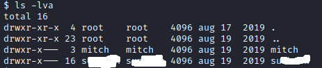

# Simple CTF

Hello, and welcome to my write-up/walkthrough for the TryHackMe room [Simple CTF](https://tryhackme.com/room/easyctf)

As with all of my other guides, anytime the IP address of the target machine is used in either a command, or needed, it will be denoted as `$ip` as this will always vary. 

With that out of the way let's begin!

## Question 1: How many services are running under port 1000?

As always, the first step that we are going to want to take is to run an `nmap` scan against the target `$ip`. However this time, they only want to know what is running on `ports 1-999` which makes it a bit more intersting. 

### nmap

To utilize `nmap` we can run the command `nmap -sV -sC -p 1-999 $ip`. Doing so we get the following:

Just on the offchance that by their wording, I did an additional scan that included `port 1000` which provided no additional results. 

We can see that the answer is *

## Question 2: What is running on the higher port?

This one took me by a bit of a surprise. If we look at the results of the last `nmap` scan, the only two services running were `http` on port 80 and `ftp` on port 21. Entering `ftp` into the answer, gets us the message `incorrect answer`. So we go back to `nmap` and re-run the scan, but this time dropping the `-p 1-999` option. Doing so shows us the following:

They got tricky on us, and decided to run *** through `port 2222`!

This gives us the answer of: ***

## Question 3: What's the CVE you're using against the application?

While this one didn't seem apparent at first, there is a single line in the `nmap` results that give us a clue

Before we attempt to connect to the FTP server anonymously, I wanted to vist the address of the target machine. So I went and entered `$ip` into a web browser. When we do this, we get the following 'default' page:

That didn't really give us THAT much to work with, so the last thing that I wanted to do before connecting to the FTP server was to run a `gobuster` scan against the target `$ip`

### gobuster

For this scan, we can run the command `gobuster dir -u http://$ip -w /usr/share/wordlists/dirb/common.txt` Doing so gave us the following result:

We can see that there exists a `robots.txt`, so I think we should go check that out. 

Visiting `$ip/robots.txt` Showed us the following page:

There are a few things here to take note of. 

The first being what is under Disallow. `Dissalow: /openemr-5_0_1_3`

The second is at the very bottom with the name `mike`

The other entry in the `gobuster` scan, `/simple` looks interesting. That is the next thing that I want to check out. 

Visiting `$ip/simple` brings us to an interesting page:

After scrolling around, I found a version number that may be the hint we need to find the CVE we are looking for:

So we now can see that this page is running `CMS Made Simple version 2.2.8`

Running a quick search for `CMS made simple version 2.2.8 CVE` gave us this page:

So we now have the CVE for the exploit that we will be using: `CVE-20**-9***`, and that is the answer to question 3. 

## Question 4: To what kind of vulnerability is the application vulnerable?

Looking over the page that we found the CVE in, we can see that it is vulnerable to `S***` or `S** *********`

The answer to question 4 is `S***`

## Question 5: What's the password?

Now, we get to use the exploit! Upon visiting the exploit-db.com page for the CVE that we just found, we can download the exploit. For me the file was named `46635.py`. Once we have that on our machine, we need to navigate to the directory that we saved it to, to run it. A quick glance of the `.py` script shows us that we will need to run it with a few added options. 

`-u` followed by the url of the target. In our case `-u $ip`
`-c` to specify that we are going to be cracking the login, and
`-w` to specify a wordlist. For this one, I plan on using seclists/common.

Upon running it, I ran into some issues with this script. `46635.py` is a python2 script, and requires some extra tinkering to get it to run with python2. You will need to install the `termcolor` module, and it can get tricky if you have python2 and python3 installed. 

First run `pip install termcolor`. When I did that I got the following result:

I did some further digging, and found that all I needed to do was copy `termcolor.py` file into the python2 directory. 

You can do that with `sudo cp /usr/lib/python3/dist-packages/termcolor.py /usr/lib/python2.7`

Once that's complete and we run `python2 46635.py` we will see the following:

Now we just have to fill in the values and run it. I used

`python2 exploit.py -u $IP/simple -c -w /usr/share/seclists/Passwords/CommonCredentials/best-1050.txt`

Once that has completed, we will see the following:

## Question 6: Where can you login with the deatails obtained?

If we look back at the `nmap` results, we can see that `s*\*` was running on port `2222`, and if we use the password we found after running the following command, we can see that we can in fact log in!

`ssh mitch@$ip -p 2222`

The answer to 6 is ***

## Question 7: What's the user flag?

Upon connecting, if we run an `ls` we can see that the directory contains `user.txt`. View it with `cat user.txt` and we get the answer for question 7.

## Question 8: Is there any other user in the home directory? What's its name?

If we run `cd ..` followed by `ls` we can see the other user in the home directory.

## Question 9: What can you leverage to spawn a privileged shell?

If we run `sudo -l` and enter the password, we can see that we can use sudo with `vim`

Taking a look at [GTFObins](https://gtfobins.github.io) and searching for `vim` shows us a few ways that we can utilize this to our advantage. 

Jumping down to the `sudo` section, we can see the following:

If we go back to our ssh connection, we can run `sudo vim -c ':!/bin/sh'` and we should be able to run `whoami` to see that we are now `root`

## Question 10: What's the root flag?

Now that we have escalated to `root`, we can navigate to `/root` with `cd /root` and see the contents of `root.txt` with `cat root.txt`

With that, we have the answer to all of the questions, and completed the room!

#### Conclusion

Thank you for taking the time to read this write-up/walkthrough for this room. I hope it helped you with your completion.

Check out my other write-ups at [https://github.com/Alex-Palmer616/THM-APalmer/readme.md](https://github.com/Alex-Palmer616/THM-APalmer/readme.md)

