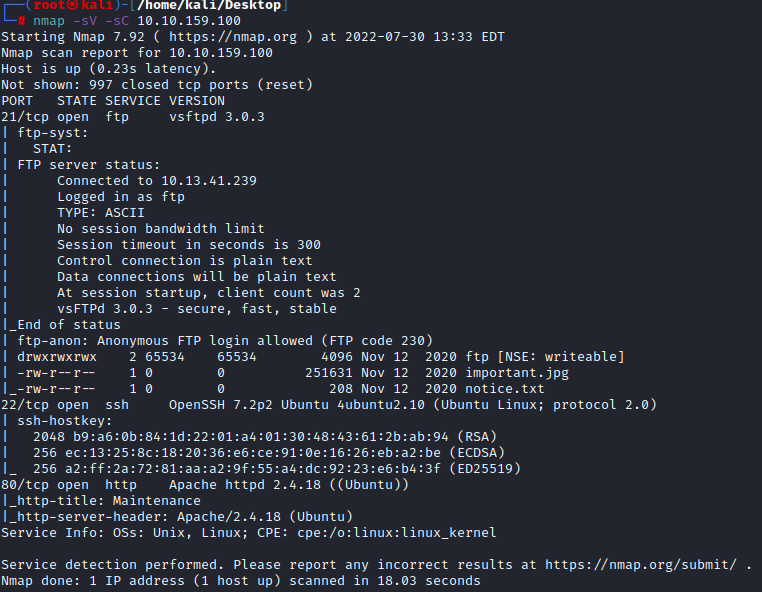

# Startup

## Intro

Hello and welcome to my writeup/walkthrough for the TryHackMe room [Startup](https://tryhackme.com/room/startup). 

At any point that an IP address is denoted as `$IP`, you will need to replace that with the Target Machines IP address. 

With that out of the way, lets begin!

## Enumeration

#### nmap

As always with any challenge the first step that we need to take is to take a look at the target and see what ports and services are running on the target machine.

We can do that using `nmap` and we can scan the target using the following command:

`nmap -sV -sC $IP`

As you can see from the image above we found that there are three ports open.

- 21 (FTP) _note:_The scan showed that Anonymous FTP login is allowed. Whenever you see this, it will often come of use later on.
- 22 (SSH)
- 80 (HTTP)

To continue on, we can continue enumeration using a tool called `gobuster` to try and see what directories and files are located on the target.

#### gobuster

We can run a scan against the target with the tool `gobuster` using the following command:

`gobuster dir -u http://$IP -w /usr/share/wordlists/dirb/common.txt`

Below we can see that we did find a few potentially interesting directories.

Let's take note, and continue to access more of this machine.

### Checking out the website.

As we discovered that port 80 was open on the target `$IP` during our `nmap` scan, and we found an `index.html` with our `gobuster` scan, we should be able to access the targets website. 

When we vist `http://$IP` we get a little note from the 'devs' but nothing to really note here.

Same goes for viewing the page source.

Next we will take a look into the `/files` directory that we found with the `gobuster` scan. 

Most notably, we can see that there is a `ftp` directory, but as of now, it is empty.

There also are two other files:

- An Among Us meme

- A notice telling people to stop uploading those Among Us memes. They also mention that `Maya` is looking pretty "sus", so we will take note of that name just incase we need a username later on. 

Now we need to see what we can do with that `ftp` directory. According to the `nmap` scan, it should allow for anonymous access. 

### FTP

Connect to the `ftp` server using `ftp $IP` and when prompted for a username, enter `anonymous` and submit an empty password. 

Now that we are in, we need to have a look around, and see if there is anything else of use. 

It doesn't look like theres anything else, so we need to see if we can upload via `ftp`

Once we navigate to the `ftp` directory, we can 
