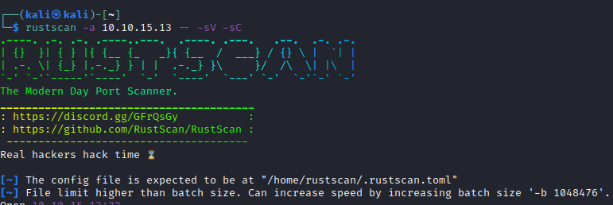
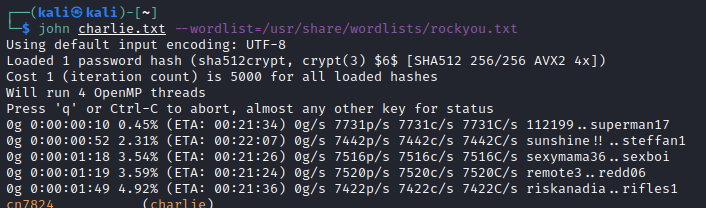

# Chocolate Factory

## Introduction

Hello, and welcome to my walkthrough and write up for the [TryHackMe](https://tryhackme.com) room [Chocolate Factory](https://tryhackme.com/room/chocolatefactory).

A quick note before I continue. Any time that `$IP` is used in a given command, that will be the target machines IP address.

This room has a few different things that we will be looking for. Under the `Challenges` section of the room, they ask the following:

- Enter the key you found!

- What is Charlie's password?

- change user to charlie

- Enter the user flag.

- Enter the root flag. 

We will keep those in mind as we continue. 

Another thing that I like to look at before starting a room is what "tags" are listed for the room on TryHackMe. These will often give us an idea of some of the things that we will need to solve it. 

This rooms tags are as follows:

- `choclatefactory`

- `CTF`

- `stego`

- `privesc`

With that out of the way, lets continue!

## Enumeration.

### nmap/rustscan

As always, I like to begin everything by running a port scan against the target. For this I have began to start utilizing `rustscan` which is `nmap` on steroids. `rustscan` scans for open ports at a high rate of speed, and then passes those ports into `nmap` to run the scan against the ports that it found. This ends up speeding up the process greatly for rooms like this one.

Information about `rustscan` can be found [here.](https://github.com/RustScan/RustScan)

We will run `rustscan` using the following command:

`rustscan -a $IP -- -sV -sC`

Once that has completed and `nmap` has finished scanning the discovered ports, we can see that there are a handful of ports that are open. 

As you can see in the screenshot below, the notable ports that were found are as follows:

- p21 (FTP)

- p22 (ssh)

- p80 (http)

There are also a large number of ports that were found that don't really seem to have services running on them that we can utilize, but include a lot of flavor text. As I was scrolling through the results however, there was one that caught my attention. `Port 113` has results that look very similar, but there is one key difference.

It looks like there is a key of some form located on `http://localhost/key_rev_key`. We will take a look at what that is later on when we start looking around on the website that is being hosted on this machine, and must be the key that they are looking for!

### gobuster

Now that we have found the open ports and services, we can continue enumeration by running a `gobuster` scan against the target using the following command:

`gobuster dir -u http://$IP -w /usr/share/wordlists/dirb/common.txt`

This really only gave us `index.html` as a result, but I often utilize `gobuster` after `nmap` and `rustscan` to see if there is anything to be discovered. 

### FTP

The last thing that I want to look at was `ftp`. In the `nmap` results, it showed that anonymous access was allowed. So let's take a look at that. 

We can start by running `ftp $IP` to connect to the FTP server, and we can enter `anonymous` when asked for a username.

 As you can see in the above screenshot, there was only a single file `gum_room.jpg`. We can copy it to our machine with `get gum_room.jpg` and we can then take a look at it. 

### Website

Next, we will go to the website that the target is hosting to see if there is anything that it has to offer. 

We can see a somewhat generic login form with a background image from the movie that this room is based around. Inspecting the page source didn't really show anything extra there. I ended up saving the image that is used for the background just in case that we will end up needing it later on. 

I played around a bit with the login using common credentials like `admin:admin`, `admin:password`, etc. with no success. I decided for the time being that I would move on, and come back to this page later. We still have the note about the key to look at, so let's take a look at that. 
 

