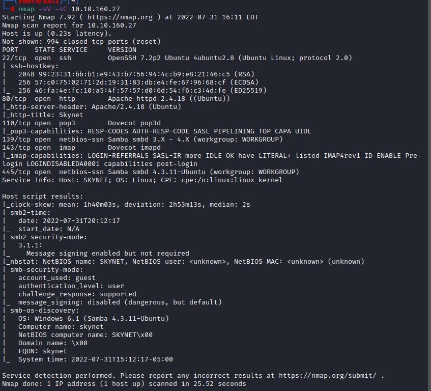
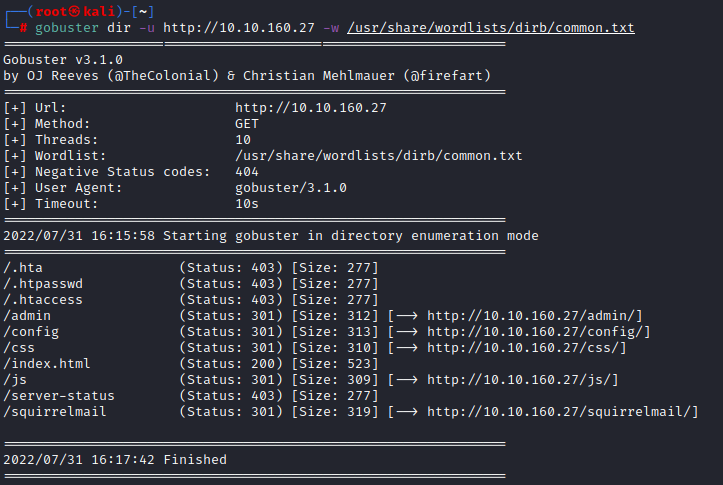

# Skynet

## Intro

Hello and welcome to my walkthrough/writeup for the [TryHackMe](HTTPS://tryhackme.com) room [Skynet](https://tryhackme.com/room/skynet).

Some quick notes:

- Any time `$IP` is mentioned or used in a command, replace that with the IP address of the target machine.
`
- Likewise, `$LHOST` if used is the IP address of your host machine.

- This room has the following tags listed on [TryHackMe](https://tryhackme.com): `gobuster`, `smb`, and `rfi`. Generally speaking those tags will give us an idea of what we will need to utilize to solve the challenge. 

With that said and out of the way, let's begin!

### Enumeration

As always the first things that we need to do are run a few scans to gather as much info as we can, so we can begin to look at possible attack vectors. 

We can do that with the tools `nmap` and `gobuster`

#### nmap

We can see what ports and potential services are running on the target with the following command:

`nmap -sV -sC $IP`

As you can see in the image below, the following ports are open:

- 22(ssh)

- 80 (http)

- 110 (pop3)

- 139 (samba/smbd)

- 143 (imap)

- 445 (samba/smbd)

#### gobuster

We can then utilize the tool `gobuster` to see if there are any hidden files or directories at `HTTP://$IP` with the command `gobuster dir -u http://$IP -w /usr/share/wordlists/dirb/common.txt`

Once that completes, we get the following results:

That's more than we usually find, so the next step is to go vist the target website, and take a look at what we found.

