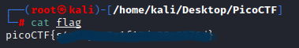

# picoCTF-

## Intro

Welcome to a quick little writeup/walkthrough for the picoGym Practice Challenge: [Obediant Cat](https://play.picoctf.org/practice/challenge/147?page=1&solved=0) hosted on [picoCTF](https://picoctf.org)

While, most of these will be short guides, I'm sure that there will be some challenging ones that will go unfinished. 

I intend to (eventually) have all rooms that I've completed, indexed, and searchable by the tool/step taken to solve them to serve as a larger "guide"

Without further ado, let's begin. 

### Description/Tasks

>This file has a flag in plain sight (aka "in-the-clear").

### Files

`flag`

While this challenges has three hints, I don't think any of them will be needed. 

Based on the name of the challenge and its description, I think this one should be pretty easy if you've used the terminal before. 

Once we have dowloaded the `flag`, we can view it using `cat flag`.

Doing so produces the following output in your terminal:

And we have found our flag!