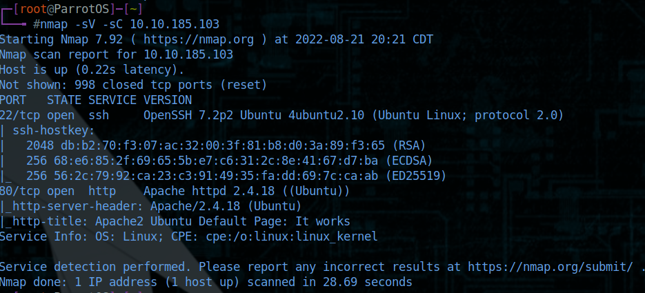

## Cyborg Notes.

Room tags: `security`, `pentest`, `bash`, `encryption`

Target machine's IP: 10.10.185.103

Questions & Goals

## Scan the machine, how many ports are open:

`nmap -sV -sC 10.10.185.103`

There are two ports open

## What Service is running on port 22:

Port 22 is SSH

## What service is running on port 80:

Port 80 is HTTP

## Further enumeration

#### Gobuster

`gobuster dir -u http://10.10.185.103 -w /usr/share/wordlists/dirb/common.txt -x html,txt,php`

/admin
/etc
/index.html
/server-status

#### john

`john --wordlist=/usr/share/wordlists/rockyou.txt passwd`

cracks as `music_archive:squidward`

The `passwd` file is to be used with `squidproxy` somehow. Need to look into details on how that works.

The archive that was downloadable from the target is not a regular archive. It is a `borg` archive. 

alex:S3cretP@s3

## What is the `user.txt` flag:

## What is the `root.txt` flag:
