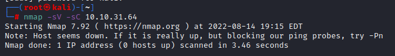
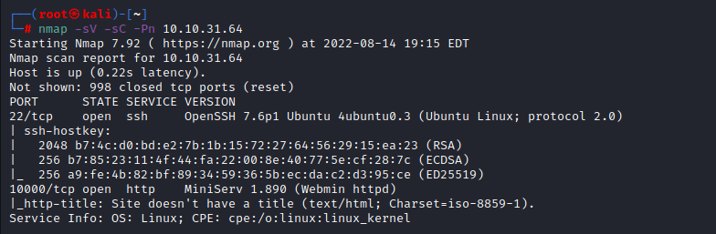

### Source Notes

Room: [Source](https://tryhackme.com/room/source)

Tags: `easy` `ctf` `realistic` `cve`

Target IP: 10.10.31.64

nmap:

`nmap -sV -sC 10.10.31.64` - Doesn't seem to find a 'host'. Adding the -Pn switch does seem to show a host. 

`nmap -sV -sC -Pn 10.10.31.64`

Miniserv 1.890

Appears to be a handful of CVE's that can be utilized. 

Searchspoint results for miniserv 1.89
